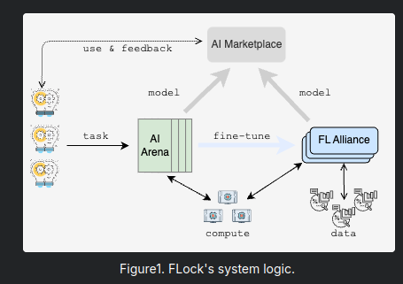
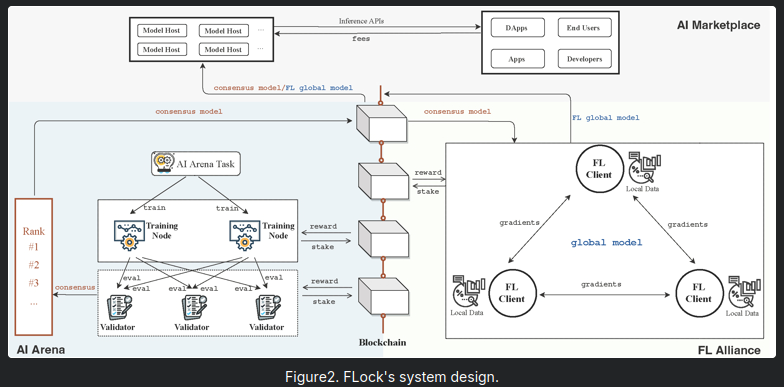

- #crypto #撸羊毛
- [toc]
- 介绍：
	- FLock.io 致力于**去中心化模型训练和价值对齐**。我们确保人工智能的目标与公众的道德和社目标的一致，决策权归属于社区，并将实用性作为重中之重。
	- FLock.io 打破了阻碍参与生态系统的障碍。我们允许开发者以模块化的方式提供模型、数据或算力。其结果是：大量由社区创造、为社区服务、并在社区管理下的**专用模型**。
	- 我们的激励平台使人工智能代理的**训练、微调和推理**民主化。它**停止了用户数据的收集**，并实现了**奖励的公平分配**和**广泛的治理**。
	- 利用区块链技术和人工智能，FLock.io 为处理大型数据集提供了一个强大的环境。
- 技术架构拆解
	- **系统设计**
		- 本节概述了 FLock 的系统设计。
		- FLock 的系统逻辑由三个主要组件组成，即：AI 竞技场（AI Arena）、联邦学习联盟（FL Alliance）和 AI 市场（AI Marketplace）。
		- 
		- 图 1. FLock 的系统逻辑。
		- 如图 1 所示，在任务创建后，模型首先在 AI 竞技场（一个基于区块链的去中心化训练平台）中进行训练和验证，然后可以选择性地在联邦学习联盟中使用参与者的本地数据进行进一步微调。最后，该模型被 AI 市场中的应用程序部署，在那里反馈将被用来进一步改进模型。
		- 
		   图 2. FLock 的系统设计。
		- 具体来说，如图 2 所示，当一个任务首次在 AI 竞技场中创建时，它首先由训练节点进行训练。然后，这些节点将他们的模型提交给验证者，验证者评估并为每个提交的模型提出分数。验证者对这些分数达成共识，以确定提交模型的排名。共识模型随后可以分配给联邦学习客户端，客户端使用他们的本地数据对其进行微调和改进，从而产生联邦学习全局模型。AI 竞技场的共识模型或联邦学习全局模型可以部署并托管在 AI 市场中，为各种应用程序提供接口。AI 竞技场的训练节点、验证者和联邦学习客户端需要质押才能参与系统，并将根据他们的表现获得奖励。
	- **区块链层**
		- 本节描述了 FLock 的区块链层如何增强激励和安全性。
		- **激励**
		- 区块链层在奖励分配中起着关键作用。它确保参与者可以安全地锁定他们的质押，从而营造一个信任和透明的环境。该过程旨在通过根据贡献分配奖励来激励参与，从而鼓励一个更积极参与的社区。通过使用智能合约，系统自动化了奖励流程，使其既高效又公平。这种自动化不仅减少了人为错误的可能性，还确保了奖励的及时和公平分配。
		- **安全**
		- 在 FLock，我们提出了一个通用框架，该框架可以将联邦学习系统与区块链系统集成，并且可以在不采用复杂的加密协议的情况下防御投毒攻击，该框架源自我们经过同行评审的工作（链接）。
		- 具体来说，FLock 采用权益证明机制，目标是确保网络内的强大安全性和共识。这种系统通过将参与者的激励与网络完整性相结合来增强拜占庭容错能力——那些行为不诚实或未能达成共识的人将面临失去其质押代币的风险。这种经济上的负面激励促进了诚实的行为，确保网络保持安全和可靠。
		- 下表描述了 FLock 如何减轻去中心化训练平台中可能发生的各种类型的风险。
		  | 攻击类型         | 描述                                                                                                                           | FLock 缓解措施                                                                                                                                                                               |
		  | :--------------- | :----------------------------------------------------------------------------------------------------------------------------- | :--------------------------------------------------------------------------------------------------------------------------------------------------------------------------------------- |
		  | 女巫攻击 (Sybil Attacks) | 攻击者可以通过创建和控制多个虚假身份的参与者，在 FLock 系统中获得不成比例的影响力。                                                       | **质押资产**增加了控制多个训练节点或验证者的难度。 **盲验证机制**防止训练节点和验证者之间的串通。 在每个任务中，只有排名前 k1 的训练节点和排名前 k2 的验证者将获得奖励，确保表现不佳的参与者不会获得奖励。 |
		  | DoS 攻击         | 攻击者可能会耗尽 FLock 系统资源，使其无法为诚实的参与者提供服务。                                                                     | **实施速率限制**以限制特定时间范围内的操作频率和数量，确保没有任何单个参与者可以压倒系统。                                                                                                   |
		  | 搭便车攻击 (Free-rider Attacks) | 搭便车者在不公平贡献的情况下从系统中获益。在 FLock 系统中，搭便车的训练节点可能会随机提交模型而不进行实际训练。类似地，搭便车的验证者给出随机分数而不是诚实地评估模型。 | 在每个任务中，只有排名前 k1 的训练节点和排名前 k2 的验证者将获得奖励，确保表现不佳的参与者不会获得报酬。 FLock AI 竞技场的共识保证了勤奋贡献的诚实参与者得到适当的认可和奖励，阻止搭便车者利用该过程。           |
		  | 查找攻击 (Lookup Attacks) | 训练节点可以通过学习预测过去的验证分数计算来作弊。                                                                                | 使用两个数据集（即数据集 A 和 B）作为验证集来评估模型。因此，即使训练节点设法针对数据集 A 优化其性能，它在数据集 B 上仍然可能表现不佳。通过仔细校准数据集 A 和 B 之间的奖励，FLock 有效地激励训练节点开发真正高质量的模型。 |
		  | 联邦学习模型投毒攻击 (FL Model Poisoning Attacks) | 在联邦学习联盟中，攻击者可能会在训练过程中使用有偏见或损坏的数据来降低模型的性能。                                                     | 通过聚合贡献，多数投票可以最大限度地减少单个恶意参与者的影响。 **罚没机制**惩罚恶意客户端，通过减少他们的奖励来阻止模型投毒并阻止未来的攻击。                                       |
	- **AI 层**
		- **AI 竞技场 (AI Arena)**
		- AI 层支持传统的机器学习 (ML) 模型训练范式，直接使用用户自己的数据或公共数据在用户的设备上优化模型。为了最大限度地提高最终训练模型的泛化能力和性能，该层旨在鼓励社区成员贡献各种公共或本地数据，利用更广泛的社区力量。通过利用区块链，它确保贡献者持续参与，并根据其数据对改进模型的可量化影响获得奖励。
		- **联邦学习联盟 (FL Alliance)**
		- 利用联邦学习 (FL) 方法，AI 层使数千名参与者能够协作训练一个全局模型，其中通过确保在训练过程的任何阶段都不传输本地数据来保护数据主权。在 AI 层中，模型聚合组件允许参与者上传使用其独特的本地数据训练的模型的权重。然后将这些权重聚合起来构建一个最佳的全局模型，从而增强其泛化能力和性能。训练任务自动化和部署编排组件的集成简化了用户加入任务并贡献从其数据中提取的有价值知识的过程。
		- **AI 市场 (AI Marketplace)**
		- 一旦模型通过 AI 竞技场和联邦学习联盟进行了训练和微调，它们就可以托管在我们的平台上。该平台作为一个综合环境，用于部署 ML 模型，使它们可以在虚拟机 (VM) 的区块链网络中访问。通过与这些网络集成，该平台促进了复杂 ML 模型的无缝执行和推理，提供实时、可扩展和安全的解决方案。
- 交互手段
	-