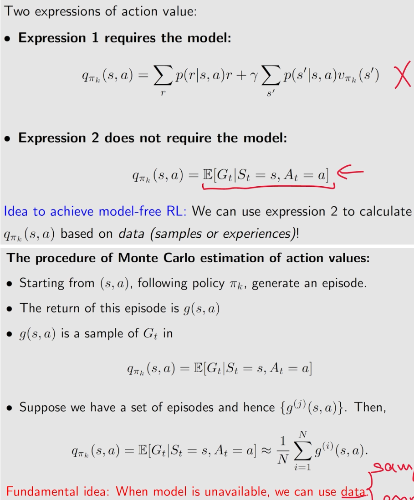
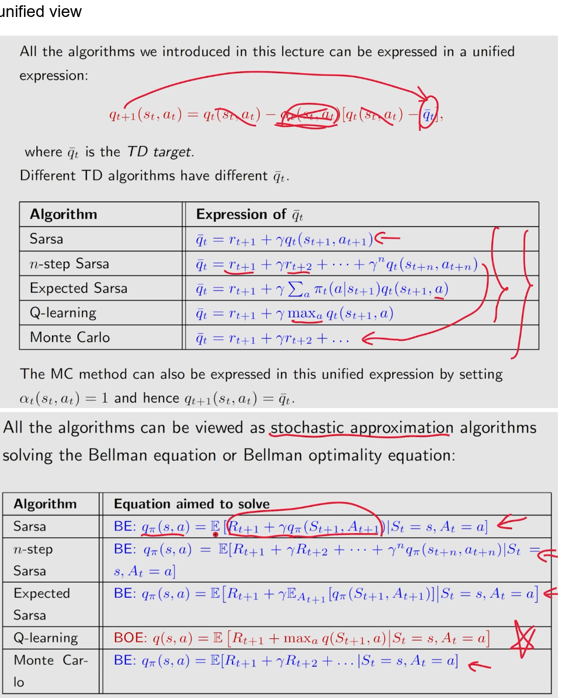

- #reinforcement_learning #dqn #value_based
- 存在这样一个轨迹:
	- $$S_t \xrightarrow{A_t} R_{t+1}, S_{t+1} \xrightarrow{A_{t+1}} R_{t+2}, S_{t+2} \xrightarrow{A_{t+2}} R_{t+3}, \dots$$
- 某一个时刻的贴现回报为$$G_t$$
	- $$\begin{align*}
	  G_t &= R_{t+1} + \gamma R_{t+2} + \gamma^2 R_{t+3} + \dots, \\
	  &= R_{t+1} + \gamma (R_{t+2} + \gamma R_{t+3} + \dots), \\
	  &= R_{t+1} + \gamma G_{t+1},
	  \end{align*}$$
- 某一个状态的價值等于贴现回报的期望
	- $$\begin{align*}
	  v_{\pi}(s) &= \mathbb{E}[R_{t+1}|S_t = s] + \gamma \mathbb{E}[G_{t+1}|S_t = s], \\
	  &= \underbrace{\sum_a \pi(a|s) \sum_r p(r|s,a)r}_{\text{mean of immediate rewards}} + \gamma \underbrace{\sum_a \pi(a|s) \sum_{s'} p(s'|s,a) v_{\pi}(s')}_{\text{mean of future rewards}}, \\
	  &= \sum_a \pi(a|s) \left[ \sum_r p(r|s,a)r + \gamma \sum_{s'} p(s'|s,a) v_{\pi}(s') \right], \quad \forall s \in S.
	  \end{align*}$$
	- 此为元素形式的贝尔曼方程,进一步简化:
	- $$
	  v_{\pi}(s) = r_{\pi}(s) + \gamma \sum_{s'} p_{\pi}(s'|s) v_{\pi}(s')
	  \\\text{where}\\
	  r_{\pi}(s) \triangleq \sum_a \pi(a|s) \sum_r p(r|s,a)r, \quad p_{\pi}(s'|s) \triangleq \sum_a \pi(a|s) p(s'|s,a)
	  $$
	- 进一步改写成矩阵向量的形式
	- $$v_{\pi} = r_{\pi} + \gamma \mathbf{P}_{\pi} v_{\pi}$$
	- $$where\\v_{\pi} = [v_{\pi}(s_1), \dots, v_{\pi}(s_n)]^T \in \mathbb{R}^n\\r_{\pi} = [r_{\pi}(s_1), \dots, r_{\pi}(s_n)]^T \in \mathbb{R}^n\\P_{\pi} \in \mathbb{R}^{n \times n}, \text{ where } [P_{\pi}]_{ij} = p_{\pi}(s_j | s_i) \text{ is the state transition matrix}$$
	-
- 求解贝尔曼方程即已知r和状态转移矩阵求解state value,有两种求解方法:
	- **封闭解 (Closed-Form Solution)**
		- 通过代数运算，可以将贝尔曼方程整理为：
		  $$v_{\pi} = (I - \gamma P_{\pi})^{-1} r_{\pi}$$
		- **优点：** 这是一个精确的、一步到位的解析解。
		- **缺点：**
			- 需要计算矩阵 (I - γ P_π) 的**逆**。
			- 矩阵求逆的计算复杂度非常高（对于 N 个状态，通常是 O(N³)），当状态空间很大时，这在计算上是不可行的 (computationally infeasible)。
			- 需要显式地知道并存储整个转移矩阵 P_π 和奖励向量 r_π。
	- **迭代解 (Iterative Solution)**
		- $$v_{k+1} = r_{\pi} + \gamma P_{\pi} v_k$$
		- **动机：** 为了避免计算成本高昂的矩阵求逆。
		- **过程解释：**
			- 从一个初始的值函数估计 v_0 开始（例如，全零向量）。
			- 使用当前的估计 v_k 来计算下一个时刻的值函数估计 v_{k+1}。这个计算基于贝尔曼方程的右侧：即时奖励 r_π 加上用当前估计 v_k 计算出的折扣后继状态期望值 γ P_π v_k。
			- 重复这个过程：v_0 -> v_1 -> v_2 -> v_3 -> ...
			- 图中的红色箭头形象地展示了这个迭代过程：用 v_k 计算出 v_{k+1}。
		- **收敛性：**
			- 图中底部指出：v_k -> v_π = (I - γ P_π)^{-1} r_π, as k -> ∞。
			- **含义：** 随着迭代次数 k 的增加，通过迭代算法得到的值函数估计 v_k 会**收敛**到真实的、唯一的策略值函数 v_π（也就是封闭解给出的那个结果）。
			- **理论基础：** 这个收敛性是由贝尔曼算子（将 v_k 映射到 v_{k+1} 的操作）是**压缩映射 (Contraction Mapping)** 保证的（基于 Banach 不动点定理）。因为 γ < 1，每次迭代都会缩小值函数估计之间的误差。
		- **优点：**
			- 避免了矩阵求逆。
			- 每次迭代主要是矩阵-向量乘法（复杂度通常为 O(N²) 或更低，如果 P_π 是稀疏的），比求逆计算成本低得多。
- action value
	- 定义
		- $$q_{\pi}(s, a) = \mathbb{E}[G_t | S_t = s, A_t = a]$$
	- 动作价值和状态价值的关系
		- $$v_{\pi}(s) = \sum_a \pi(a|s) q_{\pi}(s, a)$$
	- 又因为
		- $$v_{\pi}(s) = \sum_a \pi(a|s) \underbrace{\left[ \sum_r p(r|s,a)r + \gamma \sum_{s'} p(s'|s,a)v_{\pi}(s') \right]}$$
	- 故动作价值的计算公式为
		- $$q_{\pi}(s, a) = \sum_r p(r|s, a)r + \gamma \sum_{s'} p(s'|s, a)v_{\pi}(s')$$
- 贝尔曼最优方程
	- 对于每一个策略,都会使得状态价值不同,那么如何获得最优的策略与当前状态最优的状态价值?
	- $$v = \max_{\pi} (r_{\pi} + \gamma P_{\pi} v)$$
	- 对于当前状态的值 v(s)，我们不再局限于任何一个固定的策略 π。相反，我们考虑所有可能的策略 π。对于每一个策略 π，我们都计算“按照 π 行动一步，然后切换到最优策略”所能获得的值。然后，我们选择那个能使这个“一步+最优后续”的值达到最大的策略 π 所对应的值，作为当前状态的最优值 v(s)
- 迭代优化过程
	- **算法流程图解释:**
	  
	  `π₀ → PE → v_{π₀} → PI → π₁ → PE → v_{π₁} → PI → π₂ → PE → v_{π₂} → PI → ...`
	  $$\pi_0 \rightarrow \mathrm{PE} \rightarrow v_{\pi_0} \rightarrow \mathrm{PI} \rightarrow \pi_1 \rightarrow \mathrm{PE} \rightarrow v_{\pi_1} \rightarrow \mathrm{PI} \rightarrow \pi_2 \rightarrow \mathrm{PE} \rightarrow v_{\pi_2} \rightarrow \mathrm{PI} \rightarrow \dots$$
	-
	- 1.  $\pi_0$ (Initial Policy):*算法从一个任意的初始策略开始。
	  2. $\mathrm{PE}$ (Policy Evaluation - 策略评估):
	  * **输入:** 当前策略 $\pi_k$ (例如 $\pi_0$)。
	  * **目标:** 计算这个策略下的状态值函数 $v_{\pi_k}$ (例如 $v_{\pi_0}$ )。
	  * **方法:** 求解该策略对应的贝尔曼期望方程 $v_{\pi_k}(s) = E_{\pi_k}[R_{t+1} + \gamma v_{\pi_k}(S_{t+1}) \mid S_t=s]$。通常使用我们之前讨论的**迭代法**来完成这一步，直到值函数收敛。
	  3. $v_{\pi_0}$ (Value Function): 策略评估步骤计算出的策略 $\pi_0$ 的值函数。
	  4. $\mathrm{PI}$ (Policy Improvement - 策略改进):
	  * **输入:** 当前策略 $\pi_k$ 及其值函数 $v_{\pi_k}$ (例如 $v_{\pi_0}$ )。
	  * **目标:** 生成一个可能更好的新策略 $\pi_{k+1}$ (例如 $\pi_1$)。
	  * **方法:** 对于每个状态 $s$，根据当前值函数 $v_{\pi_k}$ **贪婪地**选择动作。也就是说，新的策略 $\pi_{k+1}(s)$ 会选择那个能够最大化单步期望回报的动作 $a$：
	  $\pi_{k+1}(s) = \operatorname*{argmax}_a q_{\pi_k}(s, a)$
	  其中 $q_{\pi_k}(s, a) = E[R_{t+1} + \gamma v_{\pi_k}(S_{t+1}) \mid S_t=s, A_t=a]$ (动作值函数)。
	  5. $\pi_1$ (Improved Policy):策略改进步骤生成的新策略。
	  6. **循环:** 算法重复执行策略评估 ($\mathrm{PE}$) 和策略改进 ($\mathrm{PI}$) 这两个步骤，不断迭代生成 $v_{\pi_1}, \pi_2, v_{\pi_2}, \pi_3, \dots$ 直到策略不再改变，此时算法收敛。
	  
	  **提出的问题 (Questions):**
	  * **Q1: 在策略评估 (policy evaluation) 步骤中，如何通过求解贝尔曼方程得到状态值** $v_{\pi_k}$
	  * **回答:** 正如我们之前讨论的，求解贝尔曼期望方程 $v = r_{\pi_k} + \gamma P_{\pi_k} v$ 来得到 $v_{\pi_k}$。由于直接求解（矩阵求逆）计算成本高，通常采用**迭代法**：从任意 $v_0$ 开始，反复应用更新规则 $v_{\text{new}}(s) \leftarrow \sum_a \pi_k(a|s) \sum_{s'} P(s'|s,a)[R(s,a,s') + \gamma v_{\text{old}}(s')]$ (或者其向量形式 $v_{\text{new}} \leftarrow r_{\pi_k} + \gamma P_{\pi_k} v_{\text{old}}$ ) 直到 $v$ 收敛。这个收敛的值就是 $v_{\pi_k}$。
	  * Q2: 在策略改进 (policy improvement) 步骤中，为什么新策略 $\pi_{k+1}$ 比 $\pi_k$ 更好？
	  * **回答:** 这基于**策略改进定理 (Policy Improvement Theorem)**。该定理表明，如果在某个状态 $s$，按照新策略 $\pi_{k+1}$ 选择的动作 $a = \pi_{k+1}(s)$ (即贪婪动作) 的动作值 $q_{\pi_k}(s, a)$ 大于原策略在该状态的值 $v_{\pi_k}(s)$，那么可以证明新策略 $\pi_{k+1}$ 在状态 $s$ 的值 $v_{\pi_{k+1}}(s)$ 至少不比原策略差，即 $v_{\pi_{k+1}}(s) \geq v_{\pi_k}(s)$。
	  * 更进一步，如果在任何状态下，新的贪婪策略选择的动作都使得 $q_{\pi_k}(s, \pi_{k+1}(s)) \geq v_{\pi_k}(s)$，那么可以保证对于所有状态 $s$，都有 $v_{\pi_{k+1}}(s) \geq v_{\pi_k}(s)$。
	  * 除非原策略 $\pi_k$ 已经是某个最优策略，否则通过贪婪改进得到的新策略 $\pi_{k+1}$ 至少在某些状态上会获得严格更优的值 ($>$)，整体上不会变差 ($\geq$)。
	  * **Q3: 为什么这样一个迭代算法最终能够达到最优策略 (optimal policy)？**
	  * **回答:**
	  	1. **改进保证:** 根据 Q2，每次策略改进要么产生一个严格更好的策略（值函数至少在一个状态上更高），要么策略保持不变。
	  	2. **有界性:** 对于有限状态和动作的 MDP，值函数是有界的。
	  	3. **有限策略:** 同样，对于有限 MDP，确定性策略的数量是有限的。
	  	4. **收敛过程:** 由于每次改进策略的值函数单调不减且有上界，并且策略空间有限，这个迭代过程不会无限地产生严格更好的策略。它最终必然会收敛到一个点，此时策略改进步骤无法再产生与当前策略不同的新策略，即 $\pi_{k+1} = \pi_k$。
	  	5. **最优性条件:** 当 $\pi_{k+1} = \pi_k$ 时，意味着策略 $\pi_k$ 对于其自身的值函数 $v_{\pi_k}$ 已经是贪婪的了。这恰好满足了贝尔曼最优方程：$v_{\pi_k}(s) = \max_a q_{\pi_k}(s, a)$。满足贝尔曼最优方程的策略就是最优策略 $\pi_*$，其对应的值函数就是最优值函数 $v_*$。因此，算法最终会收敛到最优策略。
	  * **Q4: 这个策略迭代 (policy iteration) 算法与之前的值迭代 (value iteration) 算法之间有什么关系？**
	  * **回答:**
	  	* **共同目标:** 两者都旨在找到最优策略 $\pi_*$ 和最优值函数 $v_*$。
	  	* **策略迭代 (PI):**
	  		* 交替进行**完整**的策略评估（计算出当前策略精确的 $v_\pi$）和策略改进（根据 $v_\pi$ 更新策略）。
	  		* 在策略评估步骤内部可能需要多次迭代才能使 $v_\pi$ 收敛。
	  		* 显式地维护和更新策略 $\pi$。
	  	* **值迭代 (VI):**
	  		* 直接迭代更新值函数，试图使其收敛到最优值函数 $v_*$。其更新规则是贝尔曼最优方程的应用：$v_{k+1}(s) \leftarrow \max_a \sum_{s'} P(s'|s,a)[R(s,a,s') + \gamma v_k(s')]$。
	  		* 可以看作是将策略评估（只进行**一次**迭代更新）和策略改进（通过 $\max_a$ 操作隐式完成）合并在一个步骤中。
	  		* 不显式维护策略，最优策略是在值函数收敛后通过对 $v_*$ 采取贪婪选择得到的。
	  	* **关系:** 值迭代可以看作是策略迭代的一种**截断**形式，其中策略评估步骤只进行了一次迭代更新就被策略改进步骤（$\max$ 操作）打断了。通常值迭代的收敛速度更快（指总的迭代次数），但策略迭代在某些情况下（例如策略评估收敛很快时）也可能很高效。
	  
	  **总结:** 这张图清晰地展示了策略迭代通过评估和改进的交替循环来寻找最优策略的过程，并提出了关于其工作原理、改进保证、收敛性和与其他算法（值迭代）关系的核心问题。
- ## **蒙特卡洛方法实现无需模型的学习**
	- ### 基本概念
		- {:height 913, :width 749}
		- 好的，我们来逐步理解这三个蒙特卡洛（Monte Carlo, MC）强化学习算法。它们都属于**无模型（Model-Free）**方法，即在不知道环境动态（状态转移概率 $p(s'|s,a)$ 和奖励函数 $r(s,a,s')$）的情况下学习最优策略。它们的核心思想都基于**广义策略迭代（Generalized Policy Iteration, GPI）**，即交替进行**策略评估（Policy Evaluation）**和**策略改进（Policy Improvement）**。
		  
		  **1. MC Basic Algorithm (MC 基础算法)**
		  
		  *   **目标**: 找到最优策略 $\pi^*$。
		  *   **核心思想**: 这是策略迭代思想在无模型 MC 环境下的直接体现，但实现方式非常低效。
		  *   **步骤**:
		      1.  **初始化**: 随机猜测一个初始策略 $\pi_0$。
		      2.  **循环 (策略迭代)**:
		          *   **策略评估 (Policy Evaluation)**:
		              *   **对每一个状态 `s` 和 每一个动作 `a`**:
		                  *   从这个特定的状态-动作对 `(s, a)` **开始**，然后遵循当前的策略 $\pi_k$ 运行**足够多次**完整的轨迹（episodes）。
		                  *   计算从 `(s, a)` 开始的所有这些轨迹的**平均回报（average return）**，这个平均值就是动作价值函数 $q_{\pi_k}(s, a)$ 的估计。回报是指从该步开始直到轨迹结束的累积（折扣）奖励。
		              *   *关键点*: 这一步需要对 **每一个可能的状态-动作对** 都进行大量的模拟采样来估计其价值，这在实际中几乎不可行，计算量巨大。它假设了可以从任意 `(s, a)` 对开始采样。
		          *   **策略改进 (Policy Improvement)**:
		              *   基于上一步计算得到的 $q_{\pi_k}(s, a)$，为**每个状态 `s`** 找到能使其价值最大的动作：$a_k^*(s) = \arg\max_a q_{\pi_k}(s, a)$。
		              *   生成一个新的、**确定性（deterministic）**的策略 $\pi_{k+1}$，该策略在状态 `s` 时，总是选择动作 $a_k^*(s)$（即 $\pi_{k+1}(a_k^*(s)|s) = 1$，其他动作概率为 0）。
		      3.  **终止**: 当策略不再改变或价值函数收敛时停止。
		  
		  *   **理解**: 这个算法在概念上清晰地展示了策略评估和改进的循环。但它的策略评估步骤要求对每个 (s, a) 对进行独立的、大量的采样，效率极低，并且隐含了**探索性开端（Exploring Starts）**的假设（即能够从任意 (s, a) 对开始一个 episode）。
		  
		  **2. MC Exploring Starts Algorithm (MC 探索性开端算法)**
		  
		  *   **目标**: 同样是找到最优策略 $\pi^*$，但比 MC Basic 更**样本高效（sample-efficient）**。
		  *   **核心思想**: 不再对每个 (s, a) 分别采样，而是生成完整的轨迹，然后利用**一个轨迹**中的信息来更新**该轨迹经过的所有**状态-动作对的价值估计，并进行策略改进。它明确使用了探索性开端假设。
		  *   **步骤**:
		      1.  **初始化**: 随机策略 $\pi_0$。
		      2.  **循环 (对每个 episode)**:
		          *   **生成轨迹 (Episode Generation)**:
		              *   **随机选择**一个起始状态-动作对 $(s_0, a_0)$。**关键假设：确保所有 (s, a) 对都有可能被选为起始对（Exploring Starts）**。
		              *   从 $(s_0, a_0)$ 开始，遵循**当前的策略 $\pi$**（注意，这里的 $\pi$ 是在 episodes 之间更新的）生成一个完整的轨迹：$s_0, a_0, r_1, s_1, a_1, r_2, \dots, s_{T-1}, a_{T-1}, r_T, s_T$。
		          *   **策略评估与改进 (Policy Evaluation and Policy Improvement - 交织进行)**:
		              *   初始化回报 `g = 0`。
		              *   **从后往前遍历轨迹中的每一步** `t = T-1, T-2, ..., 0`:
		                  *   更新回报：`g = γ * g + r_{t+1}` (g 累积的是从时间 t 开始的未来回报 $G_t$)。
		                  *   **使用首次访问策略 (First-visit strategy)**: 检查状态-动作对 `(s_t, a_t)` 是否是**本次轨迹中第一次**出现（从 $t=0$ 到 $t$）。
		                  *   如果是首次访问：
		                      *   将计算得到的 $g$ (即 $G_t$) 添加到 `(s_t, a_t)` 的回报列表 `Returns(s_t, a_t)` 中。
		                      *   更新 $q(s_t, a_t)$ 为 `Returns(s_t, a_t)` 列表中的**平均值**。
		                      *   **立即进行策略改进 (针对状态 `s_t`)**: 找到当前状态 $s_t$ 下价值最高的动作 $a^* = \arg\max_a q(s_t, a)$。
		                      *   将策略 $\pi(a|s_t)$ 更新为确定性策略：选择 $a^*$ 的概率为 1，其他为 0。
		  *   **理解**:
		      *   **效率提升**: 每次只生成一个 episode，并用这一个 episode 更新其中所有（首次访问的）(s, a) 对的价值和策略。这比 MC Basic 高效得多。
		      *   **Exploring Starts (ES)**: 明确依赖这个假设来保证所有 (s, a) 对最终都能被访问和评估。但在很多现实问题中，我们无法随意设定起始状态和动作。
		      *   **First-Visit**: 只使用一个 episode 中第一次访问 (s, a) 时的回报来更新 Q 值。对应的还有 **Every-Visit MC**，即每次访问都用来更新。两者理论上都能收敛。
		      *   **策略仍是确定性的**: 更新后的策略对于每个状态只选择一个最优动作。
		  
		  **3. MC ε-Greedy Algorithm (MC Epsilon 贪心算法)**
		  
		  *   **目标**: 找到最优策略 $\pi^*$，是 MC Exploring Starts 的一个变种，关键在于**去除了 Exploring Starts 假设的硬性要求**。
		  *   **核心思想**: 通过引入 **ε-greedy 策略** 来确保**持续的探索（exploration）**。即使我们不能保证从所有 (s, a) 对开始，只要智能体能通过当前策略达到足够多的状态，ε-greedy 策略就能保证所有动作最终都会被尝试。
		  *   **步骤**:
		      1.  **初始化**: 随机策略 $\pi_0$，设定一个小的探索率 `ε` (e.g., 0.1)。
		      2.  **循环 (对每个 episode)**:
		          *   **生成轨迹**:
		              *   （通常）从某个（或随机的）初始状态 $s_0$ 开始（不强制要求随机选择 $(s_0, a_0)$）。
		              *   遵循**当前的 ε-greedy 策略 π** 生成一个轨迹。
		          *   **策略评估与改进**:
		              *   初始化回报 `g = 0`。
		              *   **从后往前遍历轨迹中的每一步** `t = T-1, T-2, ..., 0`:
		                  *   更新回报：`g = γ * g + r_{t+1}`。
		                  *   **使用每次访问策略 (Every-visit method)**: （这里示例用了 Every-Visit，也可以用 First-Visit）。将回报 $g$ 添加到 `Returns(s_t, a_t)` 列表。
		                  *   更新 $q(s_t, a_t)$ 为 `Returns(s_t, a_t)` 列表的平均值。
		                  *   **找到贪心动作**: $a^* = \arg\max_a q(s_t, a)$。
		                  *   **更新策略 π (使其成为 ε-greedy)**: 对于状态 $s_t$:
		                      *   选择贪心动作 $a^*$ 的概率为 $1 - \epsilon + \frac{\epsilon}{|A(s_t)|}$。
		                      *   选择其他**非贪心动作** $a \neq a^*$ 的概率为 $\frac{\epsilon}{|A(s_t)|}$。
		                      *   其中 $|A(s_t)|$ 是状态 $s_t$ 下可行动作的数量。
		  *   **理解**:
		      *   **无需 Exploring Starts**: ε-greedy 策略保证了即使当前认为某个动作不是最优，仍然有 ε 的概率去尝试它（以及其他所有动作）。这种持续探索使得算法能在不依赖 ES 的情况下，逐渐学习到所有状态-动作对的价值。这是它相对于 MC Exploring Starts 的**主要优势和实用性所在**。
		      *   **ε-Greedy 策略**: 这是平衡**探索（Exploration，尝试新动作）**和**利用（Exploitation，选择当前最优动作）**的常用方法。
		      *   **Every-Visit**: 这里用了 Every-Visit，计算更简单。
		      *   **策略是软策略（Soft Policy）**: 策略是随机的（probabilistic），而不是确定性的，因为它总会以一个小概率选择非最优动作。
		  
		  **总结与对比**:
		  
		  *   **MC Basic**: 理论基础，效率极低，需要对每个 (s, a) 单独大量采样。
		  *   **MC Exploring Starts**: 显著提高样本效率，通过处理完整 episode 更新，但依赖不切实际的 Exploring Starts 假设，生成确定性策略。
		  *   **MC ε-Greedy**: 在 MC Exploring Starts 的基础上，用 ε-greedy 策略取代了 ES 假设，确保了持续探索，使其成为一个**实用**的 MC 控制算法。它生成的是一个软策略（ε-greedy）。
		- 这三个算法展示了从理论概念到更实用算法的演进过程，核心在于如何有效地进行策略评估和改进，以及如何确保充分的探索以找到最优策略。MC ε-Greedy 是这三者中最常用和最基础的实用 MC 控制算法。
	- ### 疑问
		- #### q(s,a)是怎么得到的？每一个样本的reward求平均值？
		  collapsed:: true
			- 对的，你的理解非常接近核心思想！`q(s,a)` （动作价值函数）在蒙特卡洛方法中，正是通过**对样本回报求平均值**得到的估计。
			  
			  但要更精确一点，它不是直接对单个 `reward` 求平均，而是对从状态-动作对 `(s,a)` 开始经历的**完整的回报（Return）**进行平均。
			  
			  以下是详细解释：
			  
			  1.  **什么是回报 (Return)?**
			      *   回报 $G_t$ 是从时间步 $t$ 开始，直到该轨迹（episode）结束时，所获得的**累积折扣奖励**。
			      *   $G_t = R_{t+1} + \gamma R_{t+2} + \gamma^2 R_{t+3} + \dots + \gamma^{T-t-1} R_T$
			      *   其中 $R_{t+1}, R_{t+2}, \dots$ 是在时间步 $t+1, t+2, \dots$ 获得的即时奖励（reward），$\gamma$ 是折扣因子（discount factor），$T$ 是轨迹结束的时间步。
			      *   所以，回报 $G_t$ 是一个**标量值**，代表了从时间 $t$ 开始的整个未来过程的好坏程度。
			  
			  2.  **如何收集样本回报?**
			      *   算法会运行很多次的完整轨迹（episodes）。
			      *   在**每一个**轨迹中，对于**每一个**出现的状态-动作对 $(s_t, a_t)$，都会对应一个从该步开始的实际获得的回报 $G_t$。
			      *   例如，在一个轨迹 $s_0, a_0, r_1, s_1, a_1, r_2, s_2, a_2, r_3, s_3 (\text{terminal})$ 中（假设 $\gamma=1$）：
			          *   对于 $(s_2, a_2)$，回报是 $G_2 = r_3$。
			          *   对于 $(s_1, a_1)$，回报是 $G_1 = r_2 + r_3$。
			          *   对于 $(s_0, a_0)$，回报是 $G_0 = r_1 + r_2 + r_3$。
			  
			  3.  **如何计算 q(s,a)?**
			      *   算法会维护一个（或多个）数据结构来存储与每个状态-动作对 $(s,a)$ 相关联的回报。
			      *   **对于一个特定的状态-动作对 $(s,a)$**：
			          *   每次在一个轨迹中遇到这个 $(s,a)$ 对（根据 First-Visit 或 Every-Visit 策略），就计算出从这次访问开始的**回报 $G_t$**。
			          *   将这个计算出的回报 $G_t$ 收集起来。
			          *   **$q(s,a)$ 的估计值就是所有为 $(s,a)$ 收集到的回报 $G_t$ 的平均值。**
			  
			      *   **数学表达**:
			          $$q(s,a) \approx \frac{\sum_{\text{episodes } i} \sum_{\text{times } t \text{ s.t. } (S_{i,t}, A_{i,t})=(s,a)} G_{i,t}}{N(s,a)}$$
			          其中：
			          *   $i$ 遍历所有运行过的轨迹。
			          *   $t$ 遍历轨迹 $i$ 中的时间步。
			          *   $G_{i,t}$ 是轨迹 $i$ 中从时间 $t$ 开始的回报。
			          *   求和只针对那些状态-动作对恰好是 $(s,a)$ 的时刻。
			          *   $N(s,a)$ 是 $(s,a)$ 被访问的总次数（根据 First-Visit 或 Every-Visit 计数）。
			  
			      *   **实际计算**: 通常不会存储所有回报然后求平均，而是使用**增量式更新 (Incremental Update)**:
			          *   维护一个计数值 $N(s,a)$ 和当前的平均值 $Q(s,a)$。
			          *   当获得一个新的回报 $G$ 时：
			              *   $N(s,a) \leftarrow N(s,a) + 1$
			              *   $Q(s,a) \leftarrow Q(s,a) + \frac{1}{N(s,a)} (G - Q(s,a))$
			          *   或者使用常数步长 $\alpha$（常见于非平稳环境或简化实现）：
			              *   $Q(s,a) \leftarrow Q(s,a) + \alpha (G - Q(s,a))$
			  
			  **总结:**
			  
			  是的，`q(s,a)` 是通过对样本求平均得到的，但求平均的对象不是单个的 `reward`，而是每次访问 `(s,a)` 之后获得的**完整的回报（Return, $G_t$）**。这是蒙特卡洛方法的核心——利用完整轨迹的经验来估计价值。
		- #### 那么这样必须要完整的episode才能计算出q？
		  collapsed:: true
			- 是的，**标准（或经典）的蒙特卡洛（Monte Carlo, MC）方法确实需要等到一个完整的 episode 结束之后，才能计算该 episode 中所有状态-动作对的回报（Return, $G_t$），进而更新对应的 $q(s,a)$ 值。**
			  
			  这就是 MC 方法的一个核心特点和限制：
			  
			  1.  **回报的定义**: 如前所述，回报 $G_t = R_{t+1} + \gamma R_{t+2} + \dots + \gamma^{T-t-1} R_T$ 定义为从时间步 $t$ 之后直到轨迹**终点** $T$ 的所有折扣奖励之和。
			  2.  **计算依赖**: 要计算 $G_t$，你必须知道从 $t+1$ 到 $T$ 的所有奖励 $R_{t+1}, \dots, R_T$。这意味着你必须经历完整个 episode，知道它在哪里结束以及过程中所有的奖励。
			  3.  **更新时机**: 因此，MC 方法的更新是**离线的（offline）**，这里的“离线”是指在**一个 episode 内部**是离线的。你必须先完成整个 episode 的交互，收集到完整的序列 $(s_0, a_0, r_1, s_1, \dots, s_{T-1}, a_{T-1}, r_T, s_T)$，然后才能从后往前（或者一次性地）计算出每一个时间步 $t$ 的回报 $G_t$，并用这个 $G_t$ 去更新相应的 $q(s_t, a_t)$。
			  
			  **这与时序差分（Temporal Difference, TD）学习方法（如 Q-learning, SARSA）形成了鲜明对比：**
			  
			  *   **TD 方法**: TD 方法不需要等待 episode 结束。它们使用**自举（bootstrapping）**，即利用当前的价值估计来更新之前的价值估计。例如，Q-learning 的更新目标是 $r_{t+1} + \gamma \max_{a'} Q(s_{t+1}, a')$。这个目标只需要知道**下一步**的奖励 $r_{t+1}$ 和**下一步**的状态 $s_{t+1}$（以及对 $s_{t+1}$ 的 Q 值估计），就可以在时间步 $t+1$ 结束后**立即**更新 $Q(s_t, a_t)$。TD 更新是**在线的（online）**。
			  
			  **总结:**
			  
			  是的，蒙特卡洛方法的一个标志性特征就是它必须等到 episode 结束后才能进行价值更新，因为它依赖于该 episode 的最终实际结果（完整的回报）。这使得 MC 方法具有**高方差**（因为回报本身波动大）但**低偏差**（因为它使用的是实际发生的结果，不依赖可能有偏差的中间估计）的特点。而 TD 方法则相反，可以在线更新，通常具有**较低方差**但可能引入**偏差**（因为更新依赖于可能不准确的现有价值估计）。
- ## **时序差分学习 (Temporal Difference, TD Learning)**
	- ### 基本概念
		- $$\underbrace{v_{t+1}(s_t)}_{\text{new estimate}} = \underbrace{v_t(s_t)}_{\text{current estimate}} - \alpha_t(s_t) \overbrace{\left[ v_t(s_t) - \underbrace{[r_{t+1} + \gamma v_t(s_{t+1})]}_{\text{TD target } \bar{v}_t} \right]}^{\text{TD error } \delta_t},$$
		- Q-learning
			- $$\begin{align*}
			  q_{t+1}(s_t, a_t) &= q_t(s_t, a_t) - \alpha_t(s_t, a_t) \left[ q_t(s_t, a_t) - \left[ r_{t+1} + \gamma \max_{a \in \mathcal{A}} q_t(s_{t+1}, a) \right] \right] \\
			  q_{t+1}(s, a) &= q_t(s, a), \quad \forall (s, a) \neq (s_t, a_t),
			  \end{align*}$$
		- #### 比较sarsa和qlearning
		  collapsed:: true
			- 
			- 
			-
			- sarsa是onpolicy策略,生成样本的策略和更新的策略是同一个策略
			- qlearning是offpolicy策略,生成训练样本的策略和更新的策略可以不是同一个策略
			- **关键区别**在于更新时如何处理**下一个动作**：
			  collapsed:: true
				- SARSA 使用**实际选择**的下一个动作 A_{t+1} (On-Policy)。
				- Q-learning 的 Off-Policy 性质使其**天然适合**与**经验回放**结合，从而**显式地、随机地重用历史数据**进行更新，提高样本效率和稳定性。
				- Q-learning 使用能使 Q 值**最大化**的动作的 Q 值估计 max_a Q(S_{t+1}, a) (Off-Policy)。
			- 好的，我们来逐一理解这三个基于时序差分（Temporal Difference, TD）学习的算法。它们都属于**无模型（Model-Free）**方法，并且与蒙特卡洛方法不同，它们可以在 **episode 结束前**就进行价值更新（**在线学习**）。
			  
			  **共同点:**
			  
			  *   都在 episode 内部，一步一步地学习。
			  *   都使用一个**学习率 `α`** 来控制每次更新的幅度。
			  *   都使用**折扣因子 `γ`** 来衡量未来奖励的价值。
			  *   都试图学习**动作价值函数 `q(s,a)`**。
			  *   都在学习过程中使用某种策略（通常是 ε-greedy）来平衡探索和利用。
			  
			  **1. SARSA (State-Action-Reward-State-Action)**
			  
			  *   **核心思想**: **On-Policy TD 控制**。它学习的是**当前正在执行的策略**（包括其探索行为）的价值。其名字来源于更新时需要用到的信息序列：$(s_t, a_t, r_{t+1}, s_{t+1}, a_{t+1})$。
			  *   **步骤 (在一个 episode 内循环)**:
			      1.  **行动**: 在当前状态 $s_t$，根据**当前策略** $\pi_t$ (通常是 ε-greedy) 选择并执行动作 $a_t$。
			      2.  **观察**: 获得奖励 $r_{t+1}$ 和下一个状态 $s_{t+1}$。
			      3.  **选择下一个动作**: 在新的状态 $s_{t+1}$，**同样根据当前策略 $\pi_t$** 选择下一个动作 $a_{t+1}$。**这是关键步骤，必须先选出 $a_{t+1}$ 才能进行更新。**
			      4.  **更新 Q 值**:
			          *   **TD 目标 (Target)**: $Y_t = r_{t+1} + \gamma q_t(s_{t+1}, a_{t+1})$
			          *   **TD 误差 (Error)**: $\delta_t = Y_t - q_t(s_t, a_t)$
			          *   **更新规则**: $q_{t+1}(s_t, a_t) = q_t(s_t, a_t) + \alpha_t \delta_t$
			          *   *解读*: 更新 $q(s_t, a_t)$ 的目标是使其接近“实际获得的即时奖励 $r_{t+1}$”加上“根据当前策略在下一状态 $s_{t+1}$ 实际选择的动作 $a_{t+1}$ 的折扣后价值”。
			      5.  **更新策略**: 基于更新后的 $q_{t+1}$ 值，更新策略 $\pi_{t+1}$ (通常保持 ε-greedy 结构，只是基于新的 Q 值来确定哪个动作是贪心动作)。
			      6.  **状态转移**: $s_t \leftarrow s_{t+1}$, $a_t \leftarrow a_{t+1}$。继续下一步循环。
			  *   **理解**: SARSA 是“跟着实际走的路线”学习。它的更新目标是基于智能体**实际会执行**的下一个动作 $a_{t+1}$。因此，如果策略 $\pi_t$ 是 ε-greedy，SARSA 学习的是遵循 ε-greedy 策略的价值，而非最优策略的价值（除非 ε 衰减到 0）。这就是为什么它被称为 **On-Policy（在策略上）**。
			  
			  **2. Q-learning (所谓 "on-policy version")**
			  
			  *   **核心思想**: **Off-Policy TD 控制**。它试图直接学习**最优动作价值函数 $q^*(s,a)$**，无论遵循的是什么探索策略。
			  *   **名称说明**: 这里的 "on-policy version" 标签可能有点**误导**，或者是指其行为策略（用于选择 $a_t$）和目标策略（它想学习的策略，即最优策略）都与当前的 Q 值相关联的一种特定实现方式。但 Q-learning 的核心更新机制是 Off-Policy 的。
			  *   **步骤 (在一个 episode 内循环)**:
			      1.  **行动**: 在当前状态 $s_t$，根据**当前策略** $\pi_t$ (通常是 ε-greedy) 选择并执行动作 $a_t$。
			      2.  **观察**: 获得奖励 $r_{t+1}$ 和下一个状态 $s_{t+1}$。
			      3.  **选择下一个动作**: **(注意：这一步与 SARSA 不同，这里不需要实际选择 $a_{t+1}$ 来进行更新)**。
			      4.  **更新 Q 值**:
			          *   **TD 目标 (Target)**: $Y_t = r_{t+1} + \gamma \max_{a'} q_t(s_{t+1}, a')$
			          *   **TD 误差 (Error)**: $\delta_t = Y_t - q_t(s_t, a_t)$
			          *   **更新规则**: $q_{t+1}(s_t, a_t) = q_t(s_t, a_t) + \alpha_t \delta_t$
			          *   *解读*: 更新 $q(s_t, a_t)$ 的目标是使其接近“实际获得的即时奖励 $r_{t+1}$”加上“在下一状态 $s_{t+1}$ **能达到的最大**折扣后价值”（通过选择最优动作 $a'$ 实现）。它**不关心**实际在 $s_{t+1}$ 会选择哪个动作 $a_{t+1}$。
			      5.  **更新策略**: 基于更新后的 $q_{t+1}$ 值，更新用于**后续行动选择**的策略 $\pi_{t+1}$ (通常是 ε-greedy)。
			      6.  **状态转移**: $s_t \leftarrow s_{t+1}$。继续下一步循环。
			  *   **理解**: Q-learning 是“看着最优路线”学习。它的更新目标总是基于在下一个状态采取**最优（贪心）**动作能获得的最大价值，**完全无视**了探索策略（如 ε-greedy）可能实际选择的非最优动作。它学习的是最优策略 $q^*$ 的价值，即使行为策略是为了探索而采取次优动作。这就是 **Off-Policy（离策略）** 的核心含义：学习的策略（最优策略）与执行的策略（行为策略，如 ε-greedy）可以不同。
			  
			  **3. Q-learning (标准 Off-policy version)**
			  
			  *   **核心思想**: 这是对 Q-learning Off-Policy 特性的更清晰表述。明确区分了**行为策略（Behavior Policy）$\pi_b$** 和 **目标策略（Target Policy）$\pi_T$**。
			  *   **步骤 (在一个 episode 内循环)**:
			      1.  **生成数据**: 使用**行为策略 $\pi_b$** (可以是任何能确保足够探索的策略，例如 ε-greedy) 与环境交互，生成轨迹数据 $(s_0, a_0, r_1, s_1, a_1, r_2, \dots)$。
			      2.  **对轨迹中的每一步 `t`**:
			          *   获取经验元组 $(s_t, a_t, r_{t+1}, s_{t+1})$。
			          *   **更新 Q 值**:
			              *   **TD 目标**: $Y_t = r_{t+1} + \gamma \max_{a'} q_t(s_{t+1}, a')$
			              *   **TD 误差**: $\delta_t = Y_t - q_t(s_t, a_t)$
			              *   **更新规则**: $q_{t+1}(s_t, a_t) = q_t(s_t, a_t) + \alpha_t \delta_t$
			              *   *解读*: Q 值更新规则与上一个版本**完全相同**，都是使用 `max` 操作符，学习最优价值。
			          *   **更新目标策略**:
			              *   目标策略 $\pi_{T, t+1}$ 被更新为相对于当前 $q_{t+1}$ 的**纯粹贪心策略**。即 $\pi_{T, t+1}(a|s_t) = 1$ 如果 $a = \arg\max_a q_{t+1}(s_t, a)$，否则为 0。
			  *   **理解**: 这个版本更清晰地展示了 Off-Policy 的概念：
			      *   **数据来源**: 数据由行为策略 $\pi_b$ 产生，$\pi_b$ 的主要目的是探索。
			      *   **学习目标**: Q 值更新是在学习最优策略（通过 `max` 操作符体现）的价值。
			      *   **最终策略**: 最终学到的目标策略 $\pi_T$ 是基于学到的最优 Q 值的纯贪心策略。
			      *   行为策略 $\pi_b$ 和目标策略 $\pi_T$ 可以完全不同。例如，$\pi_b$ 可以是随机策略，而 Q-learning 仍然可以学习到最优的 $\pi_T$。
			  
			  **总结对比**:
			  
			  *   **SARSA (On-Policy)**:
			      *   更新依赖 $(s_t, a_t, r_{t+1}, s_{t+1}, a_{t+1})$。
			      *   更新目标使用 $q_t(s_{t+1}, a_{t+1})$ (实际下一个动作的价值)。
			      *   学习的是当前执行策略（如 ε-greedy）的价值。
			      *   通常更稳定，但可能收敛到次优解（如果探索持续存在）。
			  
			  *   **Q-learning (Off-Policy)**:
			      *   更新依赖 $(s_t, a_t, r_{t+1}, s_{t+1})$。
			      *   更新目标使用 $\max_{a'} q_t(s_{t+1}, a')$ (最优下一个动作的价值)。
			      *   直接学习最优策略 $q^*$ 的价值。
			      *   可以利用来自不同策略（甚至是历史数据或人类演示）的数据进行学习。
			      *   可能更难收敛（尤其是在函数近似下），但目标是找到全局最优策略。
			  
			  这两个算法（以及它们的变种）是理解 TD 学习和 On-Policy / Off-Policy 区别的基础。
		- #### 统一视角
			- 
			- 这张图片非常清晰地展示了多种强化学习算法（Sarsa, n-step Sarsa, Expected Sarsa, Q-learning, Monte Carlo）的**统一视角（Unified View）**。核心思想是，这些算法都可以被看作是求解贝尔曼方程（或贝尔曼最优方程）的**随机近似（stochastic approximation）**方法，并且它们的更新规则都遵循一个共同的模式。
			  
			  以下是对图片内容的理解：
			  
			  **第一部分：统一的更新表达式**
			  
			  *   **表达式**:
			      $$q_{t+1}(s_t, a_t) = q_t(s_t, a_t) - \alpha_t(s_t, a_t) [q_t(s_t, a_t) - \bar{q}_t]$$
			      这个公式可以重写为更直观的形式：
			      $$q_{t+1}(s_t, a_t) = q_t(s_t, a_t) + \alpha_t(s_t, a_t) [\bar{q}_t - q_t(s_t, a_t)]$$
			      *   $q_t(s_t, a_t)$：在时间步 $t$ 对状态-动作对 $(s_t, a_t)$ 的价值估计。
			      *   $q_{t+1}(s_t, a_t)$：更新后的价值估计。
			      *   $\alpha_t(s_t, a_t)$：学习率，控制更新的步长。
			      *   $\bar{q}_t$：**TD 目标 (TD Target)**。这是当前估计值 $q_t(s_t, a_t)$ 应该靠近的目标。
			      *   $[\bar{q}_t - q_t(s_t, a_t)]$：**TD 误差 (TD Error)**（或者说是更新的目标差值）。
			  *   **核心观点**: 所有这些算法的**根本区别**在于它们如何计算 **TD 目标 $\bar{q}_t$**。
			  
			  **第二部分：不同算法的 TD 目标 ($\bar{q}_t$)**
			  
			  这张表格列出了各个算法的具体 TD 目标：
			  
			  1.  **Sarsa**: $\bar{q}_t = r_{t+1} + \gamma q_t(s_{t+1}, a_{t+1})$
			      *   目标是基于实际获得的奖励 $r_{t+1}$ 和在下一个状态 $s_{t+1}$ **实际选择**的下一个动作 $a_{t+1}$ 的 Q 值估计。这是典型的 **On-Policy** 更新。
			  2.  **n-step Sarsa**: $\bar{q}_t = r_{t+1} + \gamma r_{t+2} + \dots + \gamma^{n-1} r_{t+n} + \gamma^n q_t(s_{t+n}, a_{t+n})$
			      *   目标是基于未来 $n$ 步的实际奖励，然后加上 $n$ 步之后的状态-动作对 $(s_{t+n}, a_{t+n})$ 的 Q 值估计（$a_{t+n}$ 也是根据策略选择的）。它在 MC（完全回报）和 TD(0)（单步自举）之间进行权衡。
			  3.  **Expected Sarsa**: $\bar{q}_t = r_{t+1} + \gamma \sum_{a} \pi_t(a|s_{t+1}) q_t(s_{t+1}, a)$
			      *   目标是基于实际奖励 $r_{t+1}$ 和在下一个状态 $s_{t+1}$ 下，根据**当前策略 $\pi_t$ 的期望** Q 值。它对所有可能的下一个动作 $a$ 的 Q 值进行加权平均（权重是策略 $\pi_t$ 选择这些动作的概率）。相比 Sarsa，它降低了方差，但需要知道策略 $\pi_t$。仍然是 **On-Policy**。
			  4.  **Q-learning**: $\bar{q}_t = r_{t+1} + \gamma \max_{a} q_t(s_{t+1}, a)$
			      *   目标是基于实际奖励 $r_{t+1}$ 和在下一个状态 $s_{t+1}$ 下**可能的最优（最大）** Q 值。它不关心实际选择的下一个动作是什么，直接瞄准最优策略。这是典型的 **Off-Policy** 更新。
			  5.  **Monte Carlo (MC)**: $\bar{q}_t = r_{t+1} + \gamma r_{t+2} + \dots = G_t$ (直到 episode 结束)
			      *   目标是整个 episode 从 $(s_t, a_t)$ 开始的**完整实际回报 $G_t$**。它不使用任何当前的 Q 值估计（没有自举 bootstrapping）。
			      *   图片注解说明，MC 方法也可以看作这个统一表达式的特例，通过设置学习率 $\alpha_t=1$（对于批处理更新或首次访问 MC 的特定形式理解）。更普遍地，MC 也可以用增量更新 $\alpha_t [G_t - q_t]$。
			  
			  **第三部分：随机近似视角与求解的贝尔曼方程**
			  
			  *   **随机近似**: 这些算法都是通过采样（与环境交互得到 $s_t, a_t, r_{t+1}, s_{t+1}$ 等）来获得带有噪声的目标 $\bar{q}_t$，然后通过迭代更新 $q_t$ 来逐渐逼近某个不动点。这个过程符合随机近似的框架。
			  *   **求解目标**: 每个算法实际上是在尝试找到满足特定贝尔曼方程的动作价值函数 $q$。
			      *   **Sarsa, n-step Sarsa, Expected Sarsa, Monte Carlo**: 都在求解**贝尔曼期望方程 (Bellman Expectation equation, BE)**，即 $q_\pi(s,a)$，也就是当前遵循的策略 $\pi$ 下的真实动作价值。表格中给出了各自对应的贝尔曼方程形式（注意期望 $\mathbb{E}$ 的不同体现方式）。
			      *   **Q-learning**: 求解的是**贝尔曼最优方程 (Bellman Optimality Equation, BOE)**，即 $q_*(s,a)$，也就是最优策略下的动作价值。这体现在其期望表达式中包含了 $\max_a$ 操作。
			  
			  **总结**:
			  
			  这张图片提供了一个高度概括的视角，帮助我们理解：
			  
			  1.  **共性**: Sarsa, Q-learning, MC 等方法共享相似的迭代更新结构。
			  2.  **差异**: 核心差异在于它们用来更新当前估计的“目标值”($\bar{q}_t$)是如何计算的，这反映了它们是 On-Policy 还是 Off-Policy，以及它们在偏差-方差（Bias-Variance）权衡上的不同选择（例如，MC 低偏差高方差，TD(0) 如 Sarsa/Q-learning 可能有偏差但低方差，n-step 则居中）。
			  3.  **理论基础**: 这些算法都可以被视为使用样本数据来近似求解相应的贝尔曼方程（期望或最优）的随机过程。
	- ### 问题
		- #### Temporal Difference learning是怎么保证收敛到正确的值的？
		  collapsed:: true
			- 时序差分（Temporal Difference, TD）学习，特别是像 TD(0)（用于策略评估）和 Q-learning（用于寻找最优策略），其收敛性保证主要建立在几个关键理论基础和条件下，尤其是在**表格型（Tabular）**环境中（即状态和动作空间是有限离散的）：
			  
			  1.  **贝尔曼方程 (Bellman Equation) 作为基础**:
			      *   TD 学习的目标是找到满足相应贝尔曼方程的价值函数。
			      *   对于策略评估（估计给定策略 $\pi$ 的价值函数 $V^\pi$），贝尔曼期望方程为：
			          $$V^\pi(s) = \mathbb{E}_\pi [R_{t+1} + \gamma V^\pi(S_{t+1}) | S_t = s]$$
			      *   对于最优控制（寻找最优价值函数 $Q^*$），贝尔曼最优方程为：
			          $$Q^*(s, a) = \mathbb{E} [R_{t+1} + \gamma \max_{a'} Q^*(S_{t+1}, a') | S_t = s, A_t = a]$$
			      *   这些方程定义了价值函数的“正确”值应该是什么样的（满足固定点条件）。
			  
			  2.  **使用样本进行更新**:
			      *   TD 学习不依赖于完整的环境模型（状态转移概率 $p(s'|s,a)$）。它使用与环境交互产生的**样本** $(s_t, a_t, r_{t+1}, s_{t+1})$ 来估计贝尔曼方程右侧的期望值。
			      *   **TD(0) 更新**:
			          *   目标值 (TD Target): $Y_t = r_{t+1} + \gamma V(s_{t+1})$
			          *   更新: $V(s_t) \leftarrow V(s_t) + \alpha [Y_t - V(s_t)]$
			          *   这里的目标值 $Y_t$ 是对 $V^\pi(s_t)$ 的一个**有偏但低方差**的估计。它是有偏的，因为它使用了当前的估计 $V(s_{t+1})$ 而不是真实的 $V^\pi(s_{t+1})$。
			      *   **Q-learning 更新**:
			          *   目标值 (TD Target): $Y_t = r_{t+1} + \gamma \max_{a'} Q(s_{t+1}, a')$
			          *   更新: $Q(s_t, a_t) \leftarrow Q(s_t, a_t) + \alpha [Y_t - Q(s_t, a_t)]$
			          *   这里的目标值 $Y_t$ 是对 $Q^*(s_t, a_t)$ 的估计，使用了当前的 $Q$ 值和 `max` 操作符来逼近最优价值。
			  
			  3.  **随机近似理论 (Stochastic Approximation Theory)**:
			      *   TD 更新可以被看作是一种**随机近似**算法，试图找到一个函数的根或者优化一个目标函数，其中每次更新使用的是带有噪声的样本。
			      *   为了保证收敛到正确的值（即满足贝尔曼方程的 $V^\pi$ 或 $Q^*$），需要满足特定的条件，主要是关于**学习率 $\alpha$** 和**探索**。
			  
			  4.  **关键收敛条件 (表格型)**:
			      *   **足够多的探索**:
			          *   对于 TD(0) 评估 $V^\pi$：所有状态 $s$ 都必须被无限次访问（在无限时间极限下）。
			          *   对于 Q-learning 寻找 $Q^*$：所有**状态-动作对 $(s, a)$** 都必须被无限次访问（在无限时间极限下）。这通常通过 ε-greedy 等探索策略来保证，其中 ε 不能衰减到严格的 0（或者衰减得非常慢）。
			      *   **学习率调度 (Robbins-Monro 条件)**: 学习率 $\alpha_t$（可能依赖于状态 $s$ 或状态-动作对 $(s,a)$ 被访问的次数）必须满足：
			          1.  $\sum_{t=1}^\infty \alpha_t = \infty$ （保证学习步长足够大，能够克服任何初始误差或噪声累积）。
			          2.  $\sum_{t=1}^\infty \alpha_t^2 < \infty$ （保证学习步长最终会变得足够小，使得更新稳定下来并收敛，而不是在目标值附近无限震荡）。
			          *   一个常见的满足条件的学习率是 $\alpha_t(s,a) = 1/N_t(s,a)$，其中 $N_t(s,a)$ 是到时间 $t$ 为止 $(s,a)$ 被访问的次数。但在实践中，为了适应非平稳环境或简化，有时会使用小的**常数学习率 $\alpha$**。使用常数 $\alpha$ **不能严格保证收敛到精确值**，但可以让估计值持续跟踪可能变化的目标值，并在一个小的邻域内波动。
			      *   **有界奖励**: 奖励值通常假设是有界的。
			  
			  5.  **收敛过程的直观理解**:
			      *   每次 TD 更新都将当前的价值估计 $V(s_t)$ 或 $Q(s_t, a_t)$ 向“更好”的估计（TD 目标）拉近一小步（由 $\alpha$ 控制）。
			      *   虽然单次的 TD 目标是有偏的（因为它依赖于其他状态或动作的当前估计值），但通过**大量样本的平均效应**，这些偏差会逐渐减小。
			      *   信息通过状态（和动作）之间的转移逐步传播。一个状态的价值更新会影响到其前驱状态的下一次更新目标，依此类推。
			      *   Q-learning 中的 `max` 操作符确保了更新总是朝着最优策略的方向进行，即使行为策略是次优的（为了探索）。
			  
			  **总结:**
			  
			  在表格型环境中，TD 学习（如 TD(0) 和 Q-learning）之所以能保证收敛到正确的值，是因为：
			  
			  1.  存在一个明确的目标（由贝尔曼方程定义的真值）。
			  2.  更新是基于环境的真实样本（奖励和转移），虽然目标值包含自举（bootstrapping）的估计。
			  3.  在满足充分探索和合适的学习率衰减条件下，随机近似理论保证了通过不断采样和平均，价值估计会逐渐逼近并收敛到贝尔曼方程的不动点，即正确的价值函数。
			  
			  **需要特别注意**: 这些严格的收敛保证主要适用于**表格型**情况。当使用**函数近似（如神经网络）**来表示价值函数时，TD 学习（尤其是 Off-Policy 的 Q-learning 结合自举和函数近似）可能会变得不稳定或不收敛（所谓的“死亡三角”问题）。在这种情况下，需要使用如经验回放、目标网络（Target Networks in DQN）等技术来提高稳定性，但理论上的收敛保证就不再那么直接和牢固了。
		- #### qlearning的maxa′​qt​(st+1​,a′)是如何得到的？
		  collapsed:: true
			- 好的，我们来分解一下 Q-learning 更新规则中的 `max_a' Q(s_{t+1}, a')` 是如何得到的。
			  
			  这个项代表的是：在**下一个状态 $s_{t+1}$** 时，采取**最优（即价值最高）**的动作所能得到的**估计价值**。计算它的具体步骤如下：
			  
			  1.  **确定下一个状态 $s_{t+1}$**: 当智能体在状态 $s_t$ 执行动作 $a_t$ 后，环境会给出一个奖励 $r_{t+1}$ 和下一个状态 $s_{t+1}$。这个 $s_{t+1}$ 是计算该项的基础。
			  
			  2.  **找出 $s_{t+1}$ 中的所有可能动作**: 确定在状态 $s_{t+1}$ 下，智能体可以执行的所有合法动作。我们把这个动作集合表示为 $A(s_{t+1})$。例如，在一个网格世界中，可能的动作可能是 `up`, `down`, `left`, `right`。
			  
			  3.  **查询每个可能动作的 Q 值**: 对于 $A(s_{t+1})$ 中的**每一个**可能的动作 $a'$，查询当前的 Q 值估计 $Q_t(s_{t+1}, a')$。
			      *   **在表格型 Q-learning 中**: 这意味着直接在 Q 表（一个存储所有状态-动作对价值的表格或字典）中查找状态 $s_{t+1}$ 对应的所有动作 $a'$ 的值。
			      *   **在使用神经网络（如 DQN）的 Q-learning 中**: 这通常意味着将状态 $s_{t+1}$ 输入到 Q 网络中，网络会输出一个包含 $s_{t+1}$ 下所有可能动作的 Q 值的向量。
			  
			  4.  **找到最大值**: 比较上一步查到的所有 $Q_t(s_{t+1}, a')$ 的值，并选出其中**最大**的那个值。这个最大值就是 `max_a' Q_t(s_{t+1}, a')`。
			  
			  **举例说明 (表格型):**
			  
			  假设智能体执行动作 $a_t$ 后，从状态 $s_t$ 转移到了状态 $s_{t+1}$。
			  假设在状态 $s_{t+1}$，可行的动作有三个：$a'_1, a'_2, a'_3$。
			  假设当前的 Q 表（在时间步 $t$）对于状态 $s_{t+1}$ 的值如下：
			  *   $Q_t(s_{t+1}, a'_1) = 5.2$
			  *   $Q_t(s_{t+1}, a'_2) = 8.1$
			  *   $Q_t(s_{t+1}, a'_3) = 3.5$
			  
			  那么，计算 `max_a' Q_t(s_{t+1}, a')` 的过程就是：
			  1.  查看这三个值：5.2, 8.1, 3.5。
			  2.  找到其中的最大值：8.1。
			  因此，在这个例子中，`max_a' Q_t(s_{t+1}, a') = 8.1`。
			  
			  **关键点:**
			  
			  *   这个 `max` 操作是 Q-learning **Off-Policy** 特性的核心。它直接估计最优策略下的价值，因为它总是选择下一个状态中最优的动作来计算目标值，而**不关心**智能体实际会根据其行为策略（如 ε-greedy）在 $s_{t+1}$ 选择哪个动作。
			  *   它使用的是**当前**（时间步 $t$）的 Q 值估计 $Q_t$ 来计算这个最大值。
			-
		- #### 为什么qlearning update policy的时候就不使用ε-greedy
		  collapsed:: true
			- 这是一个非常好的问题，它触及了 Q-learning 作为一种 **Off-Policy（离策略）** 算法的核心特点。
			  
			  在 Q-learning 中，我们需要区分两个策略：
			  
			  1.  **行为策略 (Behavior Policy, $\pi_b$)**: 这是智能体实际用来与环境交互、**选择动作**以生成经验数据的策略。为了确保能够探索到所有可能的状态-动作对，行为策略**必须包含探索**。因此，行为策略通常是 **ε-greedy** 或其他具有探索性的策略（比如 Boltzmann exploration）。我们在伪代码的“Collect the experience”或“generate episode”步骤中看到的就是使用行为策略 $\pi_t$（通常是 ε-greedy）来选择动作 $a_t$。
			  
			  2.  **目标策略 (Target Policy, $\pi_T$)**: 这是 Q-learning 算法**试图学习和评估**的策略。Q-learning 的目标是找到**最优策略 $\pi^*$**。根据贝尔曼最优方程，最优策略 $\pi^*$ 总是相对于最优动作价值函数 $Q^*$ **贪婪 (greedy)** 的。也就是说，在任何状态 $s$ 下，最优策略总是选择能使 $Q^*(s,a)$ 最大化的动作 $a$。
			  
			  **为什么 Q-learning 更新目标策略时使用贪心策略，而不是 ε-greedy？**
			  
			  1.  **目标是学习最优策略**: Q-learning 的设计初衷就是直接学习最优动作价值函数 $Q^*$，进而得到最优策略 $\pi^*$。最优策略根据定义就是贪婪的。如果我们更新目标策略时还加入 ε，那我们学习到的就不是最优策略，而是某个 ε-greedy 策略了，这就违背了 Q-learning 的目标。
			  
			  2.  **Q 值更新规则已体现最优**: Q-learning 的核心更新规则是：
			      $$Q(s_t, a_t) \leftarrow Q(s_t, a_t) + \alpha [r_{t+1} + \gamma \max_{a'} Q(s_{t+1}, a') - Q(s_t, a_t)]$$
			      注意这里的 `max_a' Q(s_{t+1}, a')` 项。它在计算 TD 目标时，已经**假设**在下一个状态 $s_{t+1}$ 会采取**最优（贪心）**的动作。这个 `max` 操作符确保了 Q 值的更新是在朝着最优价值函数 $Q^*$ 逼近，**无论实际的行为策略 $\pi_b$ 在 $s_{t+1}$ 选择了什么动作**。
			  
			  3.  **Off-Policy 的优势**: 正是因为 Q 值更新独立于行为策略（只依赖于行为策略提供了哪些 $(s_t, a_t, r_{t+1}, s_{t+1})$ 样本），Q-learning 才被称为 Off-Policy。这使得我们可以用一个具有探索性的行为策略（如 ε-greedy）来收集数据，同时学习一个完全贪婪的最优目标策略。
			  
			  **总结:**
			  
			  *   **行为策略 (用于选动作产生数据)**: 需要 ε-greedy 来**保证探索**。
			  *   **目标策略 (最终要学习的策略)**: 定义为相对于学到的 Q 值的**贪心策略**，因为 Q-learning 的目标是找到**最优策略**，而最优策略本身就是贪心的。Q 值更新中的 `max` 操作符使得学习过程直接朝向这个最优目标进行。
			  
			  如果我们在更新目标策略时也使用 ε-greedy，那么整个算法就变成了 **SARSA**（或者说类似 SARSA 的 On-Policy 算法），它学习的就是它所遵循的那个 ε-greedy 策略的价值，而不是最优策略的价值。
		- #### 问题是sarsa和qlearning最终求得的q都是相同的吧？
		  collapsed:: true
			- 不，**Sarsa 和 Q-learning 最终求得的 Q 值通常是不同的**，除非在特定的条件下。
			  
			  主要原因在于它们学习的目标不同：
			  
			  1.  **Q-learning (Off-Policy)**:
			      *   **目标**: 学习**最优动作价值函数 $q^*(s,a)$**。
			      *   **更新规则**: 使用 $\max_{a'} q_t(s_{t+1}, a')$ 作为未来价值的估计。这意味着它总是假设在未来会采取最优的动作，**忽略**了实际行为策略（如 ε-greedy）可能会因为探索而选择次优动作。
			      *   **收敛结果**: 在满足收敛条件（足够的探索、合适的学习率）下，Q-learning 收敛到**最优策略**对应的 Q 值 $q^*$。
			  
			  2.  **Sarsa (On-Policy)**:
			      *   **目标**: 学习**当前正在执行的策略 $\pi$**（通常是 ε-greedy）下的动作价值函数 $q_\pi(s,a)$。
			      *   **更新规则**: 使用 $q_t(s_{t+1}, a_{t+1})$ 作为未来价值的估计。这里的 $a_{t+1}$ 是根据**当前策略 $\pi$**（包括其探索部分）**实际选择**的下一个动作。
			      *   **收敛结果**: 在满足收敛条件（所有状态-动作对被无限访问、合适的学习率）下，Sarsa 收敛到**它所遵循的行为策略**（例如 ε-greedy 策略）对应的 Q 值 $q_\pi$。
			  
			  **为什么 $q^*$ 和 $q_\pi$ 通常不同？**
			  
			  *   $q^*(s,a)$ 代表从 $(s,a)$ 开始，之后**总是**按照最优（贪心）策略行动所能获得的期望回报。
			  *   $q_\pi(s,a)$ （当 $\pi$ 是 ε-greedy 时）代表从 $(s,a)$ 开始，之后按照 **ε-greedy** 策略行动（即以 $1-\epsilon$ 概率贪心，以 $\epsilon$ 概率随机）所能获得的期望回报。
			  *   由于 ε-greedy 策略会以 $\epsilon$ 的概率选择次优动作，这通常会导致比始终选择最优动作更低的期望回报。因此，对于大多数状态-动作对，**$q_\pi(s,a) \le q^*(s,a)$**。
			  
			  **什么时候它们会相同？**
			  
			  只有一个关键情况会导致它们收敛到相同的值：
			  
			  *   **当行为策略 $\pi$ 本身就是最优策略 $\pi^*$ 时**。
			  *   这在实践中通常意味着**探索率 $\epsilon$ 随着时间的推移衰减到 0**。如果 $\epsilon \to 0$，那么 ε-greedy 策略就变成了纯粹的贪心策略。在这种情况下，Sarsa 学习的目标策略（贪心策略）就和 Q-learning 学习的目标策略（最优/贪心策略）变成了同一个。如果两个算法都能在这种情况下收敛，它们就会收敛到相同的最优 Q 值 $q^*$。
			  
			  **总结:**
			  
			  在标准的、持续探索（$\epsilon > 0$）的情况下，或者 $\epsilon$ 没有完全衰减到 0 时：
			  *   Q-learning 收敛到更“乐观”的最优 Q 值 $q^*$。
			  *   Sarsa 收敛到更“保守”的、反映了实际探索行为的 Q 值 $q_\pi$。
			  
			  因此，除非探索完全停止并且策略收敛到最优，否则 Sarsa 和 Q-learning 会得到不同的 Q 函数。
- ## **DQN (Deep Q-Network)**
	- ### DQN相对于QLEARNING的变化
		- 好的，Deep Q-Network (DQN) 是将 Q-learning 成功应用于具有**高维状态空间**（例如，直接处理像素级输入的视频游戏）的里程碑式算法。相对于传统的表格型 Q-learning，DQN 引入了几个关键的变化和技术，主要是为了解决将 Q-learning 与非线性函数近似器（即深度神经网络）相结合时出现的**不稳定**和**收敛困难**问题。
		  
		  以下是 DQN 相对于（表格型）Q-learning 的主要变化：
		  
		  1.  **使用深度神经网络进行函数近似 (Function Approximation with Deep Neural Networks)**:
		      *   **Q-learning**: 在状态和动作空间较小的情况下，使用**表格（Q-Table）**来存储和查找每一个状态-动作对 $(s, a)$ 的 Q 值。
		      *   **DQN**: 面对巨大的（甚至是连续的）状态空间（如 Atari 游戏的原始像素输入），表格方法变得不可行（维度灾难）。DQN 使用一个**深度神经网络（称为 Q-Network）**来近似动作价值函数 $Q(s, a; \theta)$。
		          *   网络的**输入**通常是状态 $s$（例如，游戏画面的几个连续帧）。
		          *   网络的**输出**通常是对应于该状态下**所有可能动作**的 Q 值向量（即，对每个动作 $a$，输出一个 $Q(s, a; \theta)$）。
		          *   $\theta$ 代表神经网络的**参数**（权重和偏置）。学习过程变成了**调整参数 $\theta$** 来让 $Q(s, a; \theta)$ 逼近最优的 $Q^*(s, a)$。
		          *   **好处:** 能够处理高维、连续的状态空间，并且具有泛化能力，可以对未见过的状态做出估计。
		  2.  **经验回放 (Experience Replay)**:
		      *   **Q-learning**: 通常是**在线学习**，获取一个经验 $(s_t, a_t, r_{t+1}, s_{t+1})$ 后立即用它来更新 Q 值，然后丢弃这个经验。
		      *   **DQN**: 引入了一个**经验回放缓冲区（Replay Buffer / Memory）**。
		          *   智能体与环境交互产生的经验 $(s_t, a_t, r_{t+1}, s_{t+1})$ 会被存储到这个缓冲区中。
		          *   在训练 Q-Network 时，不是使用刚刚产生的经验，而是从缓冲区中**随机采样一个小批量（mini-batch）**的经验来进行参数 $\theta$ 的更新（通常使用随机梯度下降 SGD 或其变种如 Adam）。
		          *   **好处**:
		              *   **打破数据相关性**: 连续的样本之间通常高度相关，这违反了许多优化算法（如 SGD）的独立同分布（i.i.d.）假设。随机采样打破了这种时间上的相关性，使得训练更稳定。
		              *   **提高数据利用率**: 一个经验可以被重复使用多次进行训练，提高了样本效率。
		  
		  3.  **目标网络 (Target Network)**:
		      *   **Q-learning (表格型)**: TD 目标 $Y_t = r_{t+1} + \gamma \max_{a'} Q(s_{t+1}, a')$ 使用的是**当前**的 Q 值来计算。
		      *   **DQN**: 当使用神经网络时，如果用同一个网络 $Q(s, a; \theta)$ 同时计算当前值和目标值，会导致目标值 $Y_t = r_{t+1} + \gamma \max_{a'} Q(s_{t+1}, a'; \theta)$ 随着 $\theta$ 的每次更新而快速变化，使得训练目标不稳定，容易产生震荡或发散（所谓的“追逐自己的尾巴”）。
		          *   为了解决这个问题，DQN 引入了一个独立的**目标网络 $Q(s, a; \theta^-)$**，其结构与在线网络 $Q(s, a; \theta)$ 完全相同。
		          *   目标网络的参数 $\theta^-$ **不会**在每次训练迭代时更新，而是**定期**（例如每隔 C 步）从在线网络的参数 $\theta$ **复制**过来 ($\theta^- \leftarrow \theta$)。在此期间，$\theta^-$ 保持**固定**。
		          *   TD 目标现在使用**目标网络**计算：$Y_t = r_{t+1} + \gamma \max_{a'} Q(s_{t+1}, a'; \theta^-)$。
		          *   **好处**: 这使得 TD 目标在短期内相对**稳定**，大大降低了训练的不稳定性，有助于收敛。在线网络 $Q(s, a; \theta)$ 的更新目标不再是快速变化的，而是追随一个“延迟”且更稳定的目标。
		  
		  **总结 DQN 的关键变化:**
		  
		  *   **Q-Table -> Q-Network**: 使用深度神经网络来处理高维状态空间。
		  *   **Online Update -> Experience Replay**: 存储经验并随机采样，打破相关性，提高样本效率。
		  *   **Single Network for Target -> Target Network**: 使用一个独立的、更新较慢的目标网络来计算 TD 目标，增加训练稳定性。
		  
		  这些创新使得 Q-learning 能够成功地与深度学习结合，解决了在高维复杂环境（如 Atari 游戏）中进行端到端强化学习的关键挑战。
		  
		  **总结:**
		  | 特征             | 传统 Q-learning (通常表格型)                     | DQN (Deep Q-Network)                                                                 |
		  | :--------------- | :----------------------------------------------- | :----------------------------------------------------------------------------------- |
		  | **价值函数表示** | 表格 (Table)                                     | **深度神经网络 (DNN/CNN)**                                                             |
		  | **状态空间**     | 小规模、离散                                     | **大规模、高维、连续 (如图像)**                                                      |
		  | **样本使用**     | 通常在线使用一次 (低效，相关性强)                | **经验回放 (Experience Replay)** (打破相关性，提高效率)                              |
		  | **TD 目标计算**  | 使用当前的 Q 表格/网络                           | 使用**固定的目标网络 (Fixed Q-Targets/Target Network)** (提高稳定性)               |
		  | **核心更新机制** | 保持 Q-learning 的 Off-policy 更新 (基于 `max`) | 保持 Q-learning 的 Off-policy 更新 (基于 `max`)，但结合 DNN、Replay 和 Target Network |
		  
		  可以说，DQN 继承了 Q-learning 的核心思想（Off-Policy TD 学习，使用 `max` 操作学习最优价值），并通过引入深度学习（函数近似）和两个关键的稳定性技巧（经验回放、目标网络）成功地将其扩展到了复杂的高维环境中。
- ## **DDPG**
	- ### DDPG相对于DQN的变化
	  collapsed:: true
		- DDPG (Deep Deterministic Policy Gradient) 是在 DQN 思想的基础上，为了解决**连续动作空间 (Continuous Action Spaces)** 问题而提出的一种算法。它结合了 DQN 的一些成功元素和 Actor-Critic 方法。
		  DDPG 相比 DQN 做了以下**关键变化**：
		  
		  1.  **处理连续动作空间 (Continuous vs. Discrete Actions):**
		      *   **DQN:** 主要用于**离散动作空间**。它的 Q 网络输出每个离散动作的 Q 值，策略通过选择具有最高 Q 值的动作（或 ε-greedy）来确定。在连续空间中，找到 `max_a Q(s, a)` 这个操作变得非常困难甚至不可行，因为需要在一个无限的连续空间中进行优化。
		      *   **DDPG:** 专门设计用于**连续动作空间**。它不直接计算所有动作的 Q 值然后取最大，而是使用一个**策略网络 (Actor)** 直接输出一个**确定性 (Deterministic)** 的动作。
		  
		  2.  **算法框架 (Value-based vs. Actor-Critic):**
		      *   **DQN:** 属于**价值基础 (Value-based)** 方法（具体是 Q-learning 的变种）。它主要学习一个价值函数（Q 函数），策略是根据这个价值函数隐式导出的（例如 ε-greedy）。
		      *   **DDPG:** 属于**演员-评论家 (Actor-Critic)** 方法。它显式地学习两个网络：
		          *   **演员 (Actor) 网络 (`μ(s; θ^μ)`):** 策略网络，输入状态 `s`，直接输出一个**确定性**的动作 `a = μ(s)`。目标是最大化期望回报。
		          *   **评论家 (Critic) 网络 (`Q(s, a; θ^Q)`):** 动作价值网络，输入状态 `s` 和动作 `a`（通常是 Actor 输出的动作），输出该状态-动作对的 Q 值。目标是准确评估 Actor 选择的动作的好坏。
		  
		  3.  **策略学习方式 (Implicit vs. Explicit Policy Gradient):**
		      *   **DQN:** 策略是隐式的，通过对 Q 网络输出的 Q 值进行 ε-greedy 选择得到。网络本身不直接代表策略。
		      *   **DDPG:** 策略由 Actor 网络**显式**表示。Actor 网络的更新使用**确定性策略梯度 (Deterministic Policy Gradient, DPG)**。Critic 网络计算 Q 值，并提供梯度信号来指导 Actor 网络更新其参数 `θ^μ`，使其输出能够获得更高 Q 值的动作。Actor 的更新方向大致是 `∇_{θ^μ} Q(s, μ(s; θ^μ); θ^Q)`。
		  
		  4.  **Q 值网络输入 (State-only vs. State-Action):**
		      *   **DQN:** Q 网络通常输入状态 `s`，输出所有离散动作的 Q 值。
		      *   **DDPG:** Critic (Q) 网络需要输入**状态 `s` 和动作 `a`**，输出一个标量的 Q 值 `Q(s, a)`。这是因为动作是连续的，无法像 DQN 那样为每个动作输出一个值。Critic 需要评估 Actor 产生的具体连续动作。
		  
		  5.  **目标网络 (Target Networks):**
		      *   **DQN:** 使用一个目标 Q 网络 (`Q'`) 来稳定 Q 学习的更新目标。
		      *   **DDPG:** **同时使用**目标 Actor 网络 (`μ'`) 和目标 Critic 网络 (`Q'`)。
		          *   Critic 的更新目标计算为：`y = r + γ Q'(s', μ'(s'; θ^{μ⁻}); θ^{Q⁻})`。注意这里使用了**目标 Actor 网络 `μ'`** 来选择下一个状态 `s'` 的动作，然后用**目标 Critic 网络 `Q'`** 来评估这个状态-动作对。
		          *   使用目标网络是为了像 DQN 一样提高学习的稳定性。DDPG 对目标网络的更新通常采用**软更新 (Soft Update)**，而不是像 DQN 那样定期硬复制：`θ⁻ ← τθ + (1 - τ)θ⁻`，其中 `τ` 是一个很小的数（如 0.001），使得目标网络参数缓慢地跟踪在线网络参数。
		  
		  6.  **经验回放 (Experience Replay):**
		      *   **DQN:** 使用经验回放。
		      *   **DDPG:** **同样使用**经验回放。从缓冲区采样 `(s, a, r, s')` 用于更新 Actor 和 Critic 网络。由于 DDPG 是 Off-Policy 的，它可以利用存储在回放缓冲区中的（可能由旧策略产生的）经验。
		  
		  7.  **探索 (Exploration):**
		      *   **DQN:** 通常使用 ε-greedy 策略进行探索，即以 ε 的概率随机选择一个离散动作。
		      *   **DDPG:** 由于 Actor 输出的是确定性动作，不能直接用 ε-greedy。探索通常通过给 Actor 输出的动作**添加噪声**来实现，例如使用 Ornstein-Uhlenbeck 过程或简单的高斯噪声。`a = μ(s; θ^μ) + Noise`。
		  
		  **总结:**
		  
		  | 特征             | DQN                                       | DDPG                                                                 |
		  | :--------------- | :---------------------------------------- | :------------------------------------------------------------------- |
		  | **动作空间**     | **离散 (Discrete)**                       | **连续 (Continuous)**                                                |
		  | **算法框架**     | **价值基础 (Value-based)**                | **演员-评论家 (Actor-Critic)**                                       |
		  | **策略表示**     | 隐式 (ε-greedy on Q-values)             | **显式确定性策略网络 (Actor)**                                       |
		  | **学习机制**     | Q-learning (Bellman Error Minimization) | **确定性策略梯度 (DPG)** + Q-learning                                |
		  | **Q 网络输入**   | State                                     | **State & Action**                                                   |
		  | **目标网络**     | 1个 (Target Q-Network)                    | **2个 (Target Actor & Target Critic)**                               |
		  | **经验回放**     | 是                                        | 是                                                                   |
		  | **探索机制**     | ε-greedy                                  | **动作加噪声 (Action Noise)**                                        |
		  | **策略类型**     | Off-Policy                                | Off-Policy                                                           |
		  
		  DDPG 可以看作是将 DQN 的成功经验（如经验回放、目标网络）应用于连续动作空间的 Actor-Critic 框架的算法。它通过引入 Actor 网络直接输出连续动作，并利用 Critic 网络提供梯度来指导 Actor 的学习，从而解决了 DQN 在连续动作空间中的局限性。
	- ### 问题
		- #### DDPG的ACTOR网络是怎么优化的，CRITIC网络是怎么优化的
		  collapsed:: true
			- 好的，我们来分别解释 DDPG（Deep Deterministic Policy Gradient）中 Actor 网络和 Critic 网络是如何优化的。DDPG 是一种用于**连续动作空间**的 **Off-Policy** 的 **Actor-Critic** 算法。
			  
			  它包含四个主要网络：
			  
			  1.  **Actor 网络 (Online Actor)**: $\mu(s; \theta^\mu)$，根据当前状态 $s$ 输出一个确定的动作 $a$。$\theta^\mu$ 是其参数。
			  2.  **Critic 网络 (Online Critic)**: $Q(s, a; \theta^Q)$，估计在状态 $s$ 下执行动作 $a$ 的期望回报（Q 值）。$\theta^Q$ 是其参数。
			  3.  **Target Actor 网络**: $\mu'(s; \theta^{\mu'})$，Actor 网络的延迟复制版本，用于稳定 Critic 的学习。
			  4.  **Target Critic 网络**: $Q'(s, a; \theta^{Q'})$，Critic 网络的延迟复制版本，用于稳定 Critic 的学习。
			  
			  **Critic 网络 ($Q(s, a; \theta^Q)$) 的优化**
			  
			  Critic 网络的目标是**准确地估计 Actor 网络所产生动作的价值**。它的优化方式非常类似于 DQN（或 Q-learning），即通过最小化 **时序差分（TD）误差** 来进行。
			  
			  1.  **采样**: 从经验回放缓冲区（Replay Buffer）中随机采样一个小批量（mini-batch）的经验元组 $(s_i, a_i, r_i, s'_i)$。注意这里的 $a_i$ 是当初执行动作时由 *行为策略*（即带噪声的 Online Actor）产生的动作。
			  2.  **计算目标 Q 值 (TD Target)**: 使用 **Target 网络** 来计算目标值 $y_i$，以提高稳定性。
			      *   首先，使用 **Target Actor 网络** $\mu'$ 计算下一个状态 $s'_i$ 下的**最优动作** $a'_i = \mu'(s'_i; \theta^{\mu'})$。
			      *   然后，使用 **Target Critic 网络** $Q'$ 计算这个下一个状态-动作对的目标 Q 值：$Q'(s'_i, a'_i; \theta^{Q'})$。
			      *   最终的 TD 目标 $y_i$ 是：
			          $$y_i = r_i + \gamma Q'(s'_i, \mu'(s'_i; \theta^{\mu'}); \theta^{Q'})$$
			          (如果 $s'_i$ 是终止状态，则 $y_i = r_i$)
			  3.  **计算损失**: 计算当前 **Online Critic 网络** $Q$ 的输出 $Q(s_i, a_i; \theta^Q)$ 与目标值 $y_i$ 之间的**均方误差（Mean Squared Bellman Error, MSBE）**:
			      $$L(\theta^Q) = \frac{1}{N} \sum_i (y_i - Q(s_i, a_i; \theta^Q))^2$$
			      （N 是 mini-batch 的大小）
			  4.  **优化**: 使用梯度下降（例如 Adam 优化器）来**最小化**这个损失函数 $L(\theta^Q)$，从而更新 Online Critic 网络的参数 $\theta^Q$：
			      $$\theta^Q \leftarrow \theta^Q - \alpha_Q \nabla_{\theta^Q} L(\theta^Q)$$
			      ($\alpha_Q$ 是 Critic 的学习率)
			  
			  **Actor 网络 ($\mu(s; \theta^\mu)$) 的优化**
			  
			  Actor 网络的目标是学习一个策略，能够**最大化 Critic 网络所估计的 Q 值**。它不直接与奖励信号或 TD 目标交互，而是通过 Critic 的“指导”来优化。
			  
			  1.  **采样**: 同样从经验回放缓冲区中随机采样一个小批量的状态 $s_i$。（通常使用与 Critic 更新相同的 mini-batch 中的状态）
			  2.  **计算目标**: Actor 的目标是最大化从这些状态 $s_i$ 开始，执行其输出动作 $\mu(s_i; \theta^\mu)$ 后，**Online Critic 网络** $Q$ 所评估的 Q 值。
			  3.  **计算策略梯度**: 我们需要计算这个目标（即 Critic 的输出）相对于 **Actor 网络参数 $\theta^\mu$** 的梯度。这通过**链式法则（Chain Rule）**实现：
			      *   首先，计算 Online Actor 网络输出的动作 $a_i = \mu(s_i; \theta^\mu)$。
			      *   然后，计算 **Online Critic 网络** $Q$ 的输出相对于**动作输入 $a$** 的梯度：$\nabla_a Q(s_i, a; \theta^Q) |_{a=a_i}$。
			      *   接着，计算 **Online Actor 网络** 的输出 $a$ 相对于其**参数 $\theta^\mu$** 的梯度：$\nabla_{\theta^\mu} \mu(s_i; \theta^\mu)$。
			      *   根据链式法则，最终的策略梯度（平均在一个 mini-batch 上）是：
			          $$\nabla_{\theta^\mu} J(\theta^\mu) \approx \frac{1}{N} \sum_i \nabla_a Q(s_i, a; \theta^Q) |_{a=\mu(s_i; \theta^\mu)} \cdot \nabla_{\theta^\mu} \mu(s_i; \theta^\mu)$$
			  4.  **优化**: 使用**梯度上升**（因为目标是最大化 Q 值）来更新 Online Actor 网络的参数 $\theta^\mu$：
			      $$\theta^\mu \leftarrow \theta^\mu + \alpha_\mu \nabla_{\theta^\mu} J(\theta^\mu)$$
			      ($\alpha_\mu$ 是 Actor 的学习率)
			  
			  **Target 网络的更新**
			  
			  Target Actor 和 Target Critic 网络的参数 $\theta^{\mu'}$ 和 $\theta^{Q'}$ 通常使用**软更新（soft update）**或 **Polyak 平均**进行更新，而不是直接复制。这有助于保持目标值的稳定性，同时让目标网络缓慢地跟踪在线网络：
			  $$\theta^{Q'} \leftarrow \tau \theta^Q + (1 - \tau) \theta^{Q'}$$
			  $$\theta^{\mu'} \leftarrow \tau \theta^\mu + (1 - \tau) \theta^{\mu'}$$
			  其中 $\tau$ 是一个小的超参数（例如 $\tau = 0.001$ 或 $0.005$），控制更新的速度。
			  
			  **总结**
			  
			  *   **Critic 优化**: 像 Q-learning 一样，通过最小化 TD 误差（使用 Target 网络计算目标）来学习准确的 Q 值估计。**目标是准确性。**
			  *   **Actor 优化**: 通过梯度上升来调整策略，使其输出的动作能够获得更高的、由 Critic 评估的 Q 值。**目标是最大化期望回报。**
			  
			  这种 Actor 和 Critic 相互协作、交替优化的过程使得 DDPG 能够在连续动作空间中学习有效的策略。
		- #### DDPG的ACTOR更新和PPO的ACTOR更新有何区别
			- DDPG（Deep Deterministic Policy Gradient）和 PPO（Proximal Policy Optimization）都属于 Actor-Critic 方法，都包含一个 Actor（策略网络）需要优化。然而，它们优化 Actor 的方式有着显著的区别，这些区别源于它们算法设计的基本哲学（Off-Policy vs On-Policy，Deterministic vs Stochastic，稳定性机制）。
			  
			  以下是它们 Actor 更新的主要区别：
			  
			  1.  **策略类型 (Policy Type)**:
			      *   **DDPG**: Actor 输出的是一个**确定性 (Deterministic)** 动作 $a = \mu(s; \theta^\mu)$。它直接给出一个具体的动作值，而不是动作的概率分布。
			      *   **PPO**: Actor 通常输出的是一个**随机性 (Stochastic)** 策略 $\pi_\theta(a|s)$。对于连续动作空间，这通常是动作分布的参数（例如高斯分布的均值和标准差）；对于离散动作空间，这是动作的概率分布。
			  
			  2.  **梯度信号来源 (Source of Gradient Signal)**:
			      *   **DDPG**: Actor 的更新信号**直接来源于 Critic 网络**。梯度是 Critic 输出的 Q 值相对于 Actor 输出动作的梯度，再通过链式法则反向传播到 Actor 的参数。公式核心是：$\nabla_{\theta^\mu} J \approx \mathbb{E}_{s \sim \mathcal{D}} [\nabla_a Q(s, a; \theta^Q)|_{a=\mu(s; \theta^\mu)} \cdot \nabla_{\theta^\mu} \mu(s; \theta^\mu)]$。它试图调整 Actor 的参数，使其输出的动作能够获得更高的、由 Critic 评估的 Q 值。
			      *   **PPO**: Actor 的更新信号来源于**优势函数估计 (Advantage Estimate, $\hat{A}_t$)** 和**策略的对数概率梯度 ($\nabla_\theta \log \pi_\theta(a_t|s_t)$)**。梯度核心是：$\nabla_\theta J \approx \mathbb{E}_t [\nabla_\theta \log \pi_\theta(a_t|s_t) \cdot \hat{A}_t]$（在考虑 PPO 的目标函数之前的基础形式）。优势函数 $\hat{A}_t$ （通常由 Critic 的价值函数 $V$ 辅助计算，例如 GAE: $\hat{A}_t \approx Q(s_t,a_t) - V(s_t)$）衡量了在状态 $s_t$ 采取动作 $a_t$ 相对于平均动作的好坏。PPO 试图增加产生正优势动作的概率，减少产生负优势动作的概率。Critic 的作用是帮助计算优势函数，而不是直接提供 Q 值梯度。
			  
			  3.  **更新目标/损失函数 (Update Objective / Loss Function)**:
			      *   **DDPG**: 目标是**最大化期望的 Q 值** $J(\theta^\mu) = \mathbb{E}_{s \sim \mathcal{D}} [Q(s, \mu(s; \theta^\mu); \theta^Q)]$。优化过程是沿着使 Q 值增加的梯度方向更新 $\theta^\mu$。
			      *   **PPO**: 目标是**最大化一个代理目标函数 (Surrogate Objective)**，并且这个目标函数被**裁剪 (Clipped)** 或用 KL 散度惩罚，以限制新策略相对旧策略的变化幅度。最常见的 PPO-Clip 目标是：$L^{CLIP}(\theta) = \hat{\mathbb{E}}_t \left[ \min \left( r_t(\theta) \hat{A}_t, \text{clip}(r_t(\theta), 1-\epsilon, 1+\epsilon) \hat{A}_t \right) \right]$。其中 $r_t(\theta) = \frac{\pi_\theta(a_t|s_t)}{\pi_{\theta_{old}}(a_t|s_t)}$ 是重要性采样权重。目标是改进策略，但要确保改进的步伐不会太大以致于破坏稳定性。
			  
			  4.  **数据使用 (Data Usage)**:
			      *   **DDPG**: **Off-Policy**。使用**经验回放缓冲区 (Experience Replay)**，从过去收集的大量数据中随机采样 mini-batch 进行更新。这提高了样本效率，但可能引入过时数据的问题。
			      *   **PPO**: **（主要是）On-Policy**。通常使用当前策略收集一批数据，然后在这批数据上进行多次（epochs）梯度更新（利用重要性采样和裁剪来修正策略变化）。数据通常在几轮更新后就被丢弃。相比 DDPG，样本效率可能较低，但数据更新鲜。
			  
			  5.  **稳定性机制 (Stability Mechanism)**:
			      *   **DDPG**: 主要依赖**目标网络 (Target Networks)**（Target Actor 和 Target Critic）和**软更新 (Soft Updates)** 来稳定学习过程，特别是稳定 Critic 的 TD 目标，从而间接稳定 Actor 的学习。经验回放也贡献了稳定性。
			      *   **PPO**: 主要依赖其核心机制——**目标函数的裁剪 (Clipping)** 或 KL 散度惩罚——来直接限制策略更新的幅度，从而保证学习的稳定性。
			  
			  **总结关键区别**:
			  
			  | 特征             | DDPG Actor 更新                                    | PPO Actor 更新                                                                 |
			  | :--------------- | :------------------------------------------------- | :----------------------------------------------------------------------------- |
			  | **策略类型**     | 确定性 (Deterministic)                             | 随机性 (Stochastic)                                                            |
			  | **梯度来源**     | Critic 的 Q 值梯度 ($\nabla_a Q$)                    | 优势函数 ($\hat{A}$) * 策略对数概率梯度 ($\nabla_\theta \log \pi$)                   |
			  | **优化目标**     | 最大化 Critic 估计的 Q 值                          | 最大化带约束（如 Clipping）的代理目标函数 (Surrogate Objective)                    |
			  | **数据使用**     | Off-Policy (经验回放)                              | On-Policy (为主，有限重用当前批次数据)                                           |
			  | **稳定性机制** | 目标网络 & 软更新                                  | 目标函数裁剪 (Clipping) / KL 约束                                                |
			  | **与Critic关系** | Critic 直接指导 Actor 更新方向（通过 Q 值梯度）    | Critic 辅助计算优势函数，间接影响 Actor 更新（通过优势函数作为权重）           |
			  
			  总的来说，DDPG 的 Actor 更新更直接地依赖于 Critic 对其提出动作的评估，而 PPO 的 Actor 更新则基于采取的动作相对于平均水平的好坏（优势），并通过约束机制来保证策略更新的稳定性。这使得 PPO 通常被认为比 DDPG 更稳定，更容易调参，尽管 DDPG 在某些任务上可能样本效率更高。
- ## 个人总结
	- logseq.order-list-type:: number
- ## 问题
	- ### 解贝尔曼方程需要状态转移矩阵？
	  collapsed:: true
		- 这取决于你说的**“解贝尔曼方程”**具体指的是什么方法。
		  
		  1.  **使用动态规划 (Dynamic Programming, DP) 方法求解（模型已知 Model-Based）**：
		      *   **是的，需要状态转移矩阵（或等效的概率 $p(s'|s,a)$）**。
		      *   像**值迭代 (Value Iteration)** 和 **策略迭代 (Policy Iteration)** 这样的经典动态规划方法，其核心是利用贝尔曼方程或贝尔曼最优方程进行迭代更新。
		      *   以贝尔曼最优方程为例：
		          $$V^*(s) = \max_a \sum_{s'} p(s'|s,a) [r(s,a,s') + \gamma V^*(s')]$$
		          或者动作价值函数的贝尔曼最优方程：
		          $$Q^*(s, a) = \sum_{s'} p(s'|s,a) [r(s,a,s') + \gamma \max_{a'} Q^*(s', a')]$$
		      *   你可以清楚地看到，计算期望（求和 $\sum_{s'}$ 部分）**直接依赖于状态转移概率 $p(s'|s,a)$**。没有这些概率，你就无法计算在状态 $s$ 执行动作 $a$ 后，转移到各个下一状态 $s'$ 并获得相应回报的期望值。
		      *   因此，对于模型已知的环境，使用 DP 方法求解贝尔曼方程（即找到最优价值函数 $V^*$ 或 $Q^*$），状态转移矩阵（或其包含的概率信息）是必需的。
		  
		  2.  **使用无模型强化学习 (Model-Free RL) 方法求解（模型未知 Model-Free）**：
		      *   **不，不需要显式的状态转移矩阵。**
		      *   像 **蒙特卡洛 (Monte Carlo, MC) 方法**、**时序差分 (Temporal Difference, TD) 学习**（如 Q-learning, SARSA）等无模型方法，其目标也是找到满足贝尔曼（最优）方程的价值函数，但它们**不直接使用状态转移概率 $p(s'|s,a)$**。
		      *   这些方法通过与环境**交互采样**获得经验（状态 $s$, 动作 $a$, 奖励 $r$, 下一状态 $s'$），并利用这些样本来**估计**贝尔曼方程中的期望值。
		      *   例如，在 Q-learning 更新规则中：
		          $$Q(s, a) \leftarrow Q(s, a) + \alpha [r + \gamma \max_{a'} Q(s', a') - Q(s, a)]$$
		          这里我们不需要知道从 $(s, a)$ 转移到所有可能的 $s'$ 的概率。我们只需要知道**实际发生**的那一个转移：状态 $s$ 执行动作 $a$ 后，得到了奖励 $r$ 并转移到了状态 $s'$。通过大量的采样和更新，Q 函数会逐渐收敛到满足贝尔曼最优方程的 $Q^*$。
		      *   这些方法虽然最终找到的解（$V^*$ 或 $Q^*$）仍然满足贝尔曼方程，但它们求解的过程绕过了对状态转移矩阵的显式需求，而是通过采样来隐式地利用了环境的动态特性。
		  
		  **总结:**
		  
		  *   如果你指的是使用**动态规划**方法在**已知模型**下精确计算价值函数，那么**需要**状态转移矩阵/概率。
		  *   如果你指的是使用**无模型强化学习**方法在**未知模型**下通过**采样和学习**来估计价值函数，那么**不需要**显式的状态转移矩阵/概率。算法通过与环境交互得到的样本来学习。
	- ### 如果给出环境model,那么贝尔曼方程和动态规划有何关系
	  collapsed:: true
		- 你说得非常对！**理论上（尤其是在状态和动作空间较小且离散的情况下），如果你直接拥有了环境的完整模型（Model），即状态转移概率 `P(s'|s, a)` 和奖励函数 `R(s, a)`（或 `R(s, a, s')`），那么你确实可以直接求解贝尔曼方程来得到每个状态的价值（Value）**。
		  
		  这正是**动态规划 (Dynamic Programming, DP)** 方法的核心思想，例如：
		  
		  1.  **策略评估 (Policy Evaluation):** 如果你有一个固定的策略 `π(a|s)`，你可以通过迭代求解**贝尔曼期望方程 (Bellman Expectation Equation)** 来计算该策略下每个状态的价值 `V^π(s)`：
		      `V_{k+1}(s) = Σ_a π(a|s) Σ_{s'} P(s'|s, a) [R(s, a, s') + γ V_k(s')]`
		      这个迭代过程会收敛到真实的 `V^π(s)`。对于有限状态空间，这也可以表示为一个线性方程组，理论上可以直接求解（虽然迭代通常更实用）。
		  
		  2.  **价值迭代 (Value Iteration):** 如果你想找到最优价值函数 `V*(s)`，你可以通过迭代求解**贝尔曼最优方程 (Bellman Optimality Equation)**：
		      `V_{k+1}(s) = max_a Σ_{s'} P(s'|s, a) [R(s, a, s') + γ V_k(s')]`
		      这个迭代过程会收敛到最优价值函数 `V*(s)`。
		  
		  3.  **策略迭代 (Policy Iteration):** 这种方法交替进行两个步骤：
		      *   **策略评估:** 使用当前的策略 `π` 和模型，通过贝尔曼期望方程计算 `V^π(s)`（如方法 1）。
		      *   **策略改进:** 基于计算出的 `V^π(s)`，为每个状态 `s` 选择能最大化期望回报的动作，形成新的策略 `π'`：
		          `π'(s) = argmax_a Σ_{s'} P(s'|s, a) [R(s, a, s') + γ V^π(s')]`
		      这个过程会收敛到最优策略 `π*` 和最优价值函数 `V*`。
		  
		  **那么，为什么我们还需要 Model-Free RL 或其他更复杂的 Model-Based RL 方法呢？**
		  
		  主要原因在于**现实的限制**：
		  
		  1.  **模型未知 (Model Unknown):** 在绝大多数实际应用中（如机器人控制、游戏、推荐系统），我们**并不知道环境的精确模型** `P(s'|s, a)` 和 `R(s, a)`。智能体必须通过与环境交互来学习。这是 Model-Free RL 方法（如 Q-Learning, SARSA, Policy Gradient）的主要动机。
		  2.  **状态/动作空间巨大 (Large State/Action Spaces):** 即使我们拥有模型（例如，一个完美的棋类游戏模拟器），如果状态空间或动作空间非常大甚至连续：
		      *   **计算复杂度:** 显式地迭代计算所有状态的价值（如价值迭代中的 `V(s)` for all `s`）在计算上是不可行的（所谓的“维度灾难”）。存储所有状态的价值表本身也可能不可能。
		      *   **求解困难:** 求解大规模的线性方程组或执行 `max_a` 操作（尤其是在连续动作空间）可能非常困难。
		  3.  **模型表示:** 即使有模型，它可能也不是 `P` 和 `R` 的显式表格形式，而是一个复杂的模拟器。从模拟器中获取完整的转移概率 `P(s'|s, a)` 可能很困难或效率低下，我们通常只能从中*采样*下一个状态和奖励。
		  
		  **因此，总结来说：**
		  
		  *   是的，如果你有**完整的、可操作的**环境模型，并且状态/动作空间**足够小**，你可以使用动态规划（如价值迭代、策略迭代）直接求解贝尔曼方程得到精确的价值函数。
		  *   但在大多数实际场景中，由于模型未知或状态空间巨大，直接求解贝尔曼方程变得不可行。这才催生了：
		      *   **Model-Free RL:** 直接从经验中学习价值函数或策略，绕过显式模型。
		      *   **Model-Based RL (学习模型):** 先从经验中学习一个近似模型，然后利用这个近似模型进行规划或生成模拟数据（通常结合函数逼近）。
		      *   **函数逼近 (Function Approximation):** 使用神经网络等方法来近似价值函数 `V(s)` 或 `Q(s, a)`，而不是为每个状态存储一个值，从而处理大状态空间。
		  
		  希望这个解释能澄清你的疑问！
-