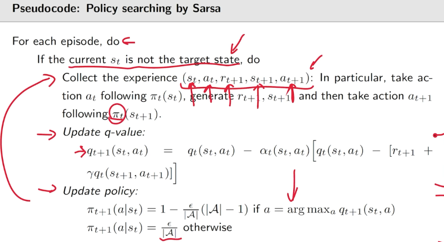
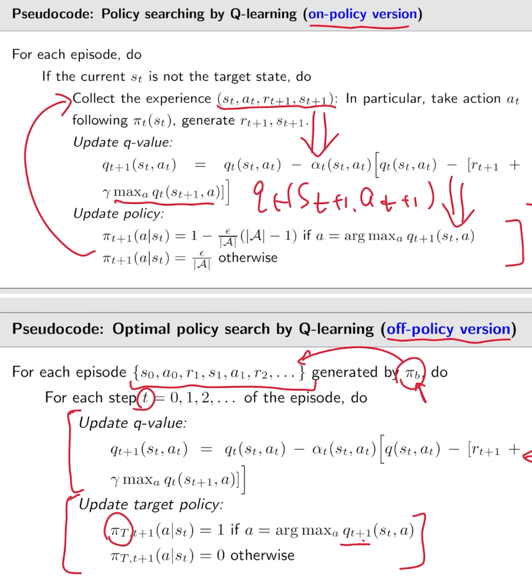

- #reinforcement_learning #dqn #value_based
- 存在这样一个轨迹:
	- $$S_t \xrightarrow{A_t} R_{t+1}, S_{t+1} \xrightarrow{A_{t+1}} R_{t+2}, S_{t+2} \xrightarrow{A_{t+2}} R_{t+3}, \dots$$
- 某一个时刻的贴现回报为$$G_t$$
	- $$\begin{align*}
	  G_t &= R_{t+1} + \gamma R_{t+2} + \gamma^2 R_{t+3} + \dots, \\
	  &= R_{t+1} + \gamma (R_{t+2} + \gamma R_{t+3} + \dots), \\
	  &= R_{t+1} + \gamma G_{t+1},
	  \end{align*}$$
- 某一个状态的價值等于贴现回报的期望
	- $$\begin{align*}
	  v_{\pi}(s) &= \mathbb{E}[R_{t+1}|S_t = s] + \gamma \mathbb{E}[G_{t+1}|S_t = s], \\
	  &= \underbrace{\sum_a \pi(a|s) \sum_r p(r|s,a)r}_{\text{mean of immediate rewards}} + \gamma \underbrace{\sum_a \pi(a|s) \sum_{s'} p(s'|s,a) v_{\pi}(s')}_{\text{mean of future rewards}}, \\
	  &= \sum_a \pi(a|s) \left[ \sum_r p(r|s,a)r + \gamma \sum_{s'} p(s'|s,a) v_{\pi}(s') \right], \quad \forall s \in S.
	  \end{align*}$$
	- 此为元素形式的贝尔曼方程,进一步简化:
	- $$
	  v_{\pi}(s) = r_{\pi}(s) + \gamma \sum_{s'} p_{\pi}(s'|s) v_{\pi}(s')
	  \\\text{where}\\
	  r_{\pi}(s) \triangleq \sum_a \pi(a|s) \sum_r p(r|s,a)r, \quad p_{\pi}(s'|s) \triangleq \sum_a \pi(a|s) p(s'|s,a)
	  $$
	- 进一步改写成矩阵向量的形式
	- $$v_{\pi} = r_{\pi} + \gamma \mathbf{P}_{\pi} v_{\pi}$$
	- $$where\\v_{\pi} = [v_{\pi}(s_1), \dots, v_{\pi}(s_n)]^T \in \mathbb{R}^n\\r_{\pi} = [r_{\pi}(s_1), \dots, r_{\pi}(s_n)]^T \in \mathbb{R}^n\\P_{\pi} \in \mathbb{R}^{n \times n}, \text{ where } [P_{\pi}]_{ij} = p_{\pi}(s_j | s_i) \text{ is the state transition matrix}$$
	-
- 求解贝尔曼方程即已知r和状态转移矩阵求解state value,有两种求解方法:
	- **封闭解 (Closed-Form Solution)**
		- 通过代数运算，可以将贝尔曼方程整理为：
		  $$v_{\pi} = (I - \gamma P_{\pi})^{-1} r_{\pi}$$
		- **优点：** 这是一个精确的、一步到位的解析解。
		- **缺点：**
			- 需要计算矩阵 (I - γ P_π) 的**逆**。
			- 矩阵求逆的计算复杂度非常高（对于 N 个状态，通常是 O(N³)），当状态空间很大时，这在计算上是不可行的 (computationally infeasible)。
			- 需要显式地知道并存储整个转移矩阵 P_π 和奖励向量 r_π。
	- **迭代解 (Iterative Solution)**
		- $$v_{k+1} = r_{\pi} + \gamma P_{\pi} v_k$$
		- **动机：** 为了避免计算成本高昂的矩阵求逆。
		- **过程解释：**
			- 从一个初始的值函数估计 v_0 开始（例如，全零向量）。
			- 使用当前的估计 v_k 来计算下一个时刻的值函数估计 v_{k+1}。这个计算基于贝尔曼方程的右侧：即时奖励 r_π 加上用当前估计 v_k 计算出的折扣后继状态期望值 γ P_π v_k。
			- 重复这个过程：v_0 -> v_1 -> v_2 -> v_3 -> ...
			- 图中的红色箭头形象地展示了这个迭代过程：用 v_k 计算出 v_{k+1}。
		- **收敛性：**
			- 图中底部指出：v_k -> v_π = (I - γ P_π)^{-1} r_π, as k -> ∞。
			- **含义：** 随着迭代次数 k 的增加，通过迭代算法得到的值函数估计 v_k 会**收敛**到真实的、唯一的策略值函数 v_π（也就是封闭解给出的那个结果）。
			- **理论基础：** 这个收敛性是由贝尔曼算子（将 v_k 映射到 v_{k+1} 的操作）是**压缩映射 (Contraction Mapping)** 保证的（基于 Banach 不动点定理）。因为 γ < 1，每次迭代都会缩小值函数估计之间的误差。
		- **优点：**
			- 避免了矩阵求逆。
			- 每次迭代主要是矩阵-向量乘法（复杂度通常为 O(N²) 或更低，如果 P_π 是稀疏的），比求逆计算成本低得多。
- action value
	- 定义
		- $$q_{\pi}(s, a) = \mathbb{E}[G_t | S_t = s, A_t = a]$$
	- 动作价值和状态价值的关系
		- $$v_{\pi}(s) = \sum_a \pi(a|s) q_{\pi}(s, a)$$
	- 又因为
		- $$v_{\pi}(s) = \sum_a \pi(a|s) \underbrace{\left[ \sum_r p(r|s,a)r + \gamma \sum_{s'} p(s'|s,a)v_{\pi}(s') \right]}$$
	- 故动作价值的计算公式为
		- $$q_{\pi}(s, a) = \sum_r p(r|s, a)r + \gamma \sum_{s'} p(s'|s, a)v_{\pi}(s')$$
- 贝尔曼最优方程
	- 对于每一个策略,都会使得状态价值不同,那么如何获得最优的策略与当前状态最优的状态价值?
	- $$v = \max_{\pi} (r_{\pi} + \gamma P_{\pi} v)$$
	- 对于当前状态的值 v(s)，我们不再局限于任何一个固定的策略 π。相反，我们考虑所有可能的策略 π。对于每一个策略 π，我们都计算“按照 π 行动一步，然后切换到最优策略”所能获得的值。然后，我们选择那个能使这个“一步+最优后续”的值达到最大的策略 π 所对应的值，作为当前状态的最优值 v(s)
- 迭代优化过程
	- **算法流程图解释:**
	  
	  `π₀ → PE → v_{π₀} → PI → π₁ → PE → v_{π₁} → PI → π₂ → PE → v_{π₂} → PI → ...`
	  
	  1.  **`π₀` (Initial Policy):** 算法从一个任意的初始策略开始。
	  2.  **`PE` (Policy Evaluation - 策略评估):**
	      *   **输入:** 当前策略 `π_k` (例如 `π₀`)。
	      *   **目标:** 计算这个策略下的状态值函数 `v_{π_k}` (例如 `v_{π₀}` )。
	      *   **方法:** 求解该策略对应的贝尔曼期望方程 `v_{π_k}(s) = E_{π_k}[R_{t+1} + γ v_{π_k}(S_{t+1}) | S_t=s]`。通常使用我们之前讨论的**迭代法**来完成这一步，直到值函数收敛。
	  3.  **`v_{π₀}` (Value Function):** 策略评估步骤计算出的策略 `π₀` 的值函数。
	  4.  **`PI` (Policy Improvement - 策略改进):**
	      *   **输入:** 当前策略 `π_k` 及其值函数 `v_{π_k}` (例如 `v_{π₀}` )。
	      *   **目标:** 生成一个可能更好的新策略 `π_{k+1}` (例如 `π₁`)。
	      *   **方法:** 对于每个状态 `s`，根据当前值函数 `v_{π_k}` **贪婪地**选择动作。也就是说，新的策略 `π_{k+1}(s)` 会选择那个能够最大化单步期望回报的动作 `a`：
	          `π_{k+1}(s) = argmax_a q_{π_k}(s, a)`
	          其中 `q_{π_k}(s, a) = E[R_{t+1} + γ v_{π_k}(S_{t+1}) | S_t=s, A_t=a]` (动作值函数)。
	  5.  **`π₁` (Improved Policy):** 策略改进步骤生成的新策略。
	  6.  **循环:** 算法重复执行策略评估 (PE) 和策略改进 (PI) 这两个步骤，不断迭代生成 `v_{π₁}, π₂, v_{π₂}, π₃, ...` 直到策略不再改变，此时算法收敛。
	  
	  **提出的问题 (Questions):**
	  
	  *   **Q1: 在策略评估 (policy evaluation) 步骤中，如何通过求解贝尔曼方程得到状态值 `v_{π_k}`？**
	      *   **回答:** 正如我们之前讨论的，求解贝尔曼期望方程 `v = r_{π_k} + γ P_{π_k} v` 来得到 `v_{π_k}`。由于直接求解（矩阵求逆）计算成本高，通常采用**迭代法**：从任意 `v_0` 开始，反复应用更新规则 `v_{new}(s) ← ∑_a π_k(a|s) ∑_{s'} P(s'|s,a)[R(s,a,s') + γ v_{old}(s')]` (或者其向量形式 `v_{new} ← r_{π_k} + γ P_{π_k} v_{old}` ) 直到 `v` 收敛。这个收敛的值就是 `v_{π_k}`。
	  
	  *   **Q2: 在策略改进 (policy improvement) 步骤中，为什么新策略 `π_{k+1}` 比 `π_k` 更好？**
	      *   **回答:** 这基于**策略改进定理 (Policy Improvement Theorem)**。该定理表明，如果在某个状态 `s`，按照新策略 `π_{k+1}` 选择的动作 `a = π_{k+1}(s)` (即贪婪动作) 的动作值 `q_{π_k}(s, a)` 大于原策略在该状态的值 `v_{π_k}(s)`，那么可以证明新策略 `π_{k+1}` 在状态 `s` 的值 `v_{π_{k+1}}(s)` 至少不比原策略差，即 `v_{π_{k+1}}(s) ≥ v_{π_k}(s)`。
	      *   更进一步，如果在任何状态下，新的贪婪策略选择的动作都使得 `q_{π_k}(s, π_{k+1}(s)) ≥ v_{π_k}(s)`，那么可以保证对于所有状态 `s`，都有 `v_{π_{k+1}}(s) ≥ v_{π_k}(s)`。
	      *   除非原策略 `π_k` 已经是某个最优策略，否则通过贪婪改进得到的新策略 `π_{k+1}` 至少在某些状态上会获得严格更优的值 (`>`)，整体上不会变差 (`≥`)。
	  
	  *   **Q3: 为什么这样一个迭代算法最终能够达到最优策略 (optimal policy)？**
	      *   **回答:**
	          1.  **改进保证:** 根据 Q2，每次策略改进要么产生一个严格更好的策略（值函数至少在一个状态上更高），要么策略保持不变。
	          2.  **有界性:** 对于有限状态和动作的 MDP，值函数是有界的。
	          3.  **有限策略:** 同样，对于有限 MDP，确定性策略的数量是有限的。
	          4.  **收敛过程:** 由于每次改进策略的值函数单调不减且有上界，并且策略空间有限，这个迭代过程不会无限地产生严格更好的策略。它最终必然会收敛到一个点，此时策略改进步骤无法再产生与当前策略不同的新策略，即 `π_{k+1} = π_k`。
	          5.  **最优性条件:** 当 `π_{k+1} = π_k` 时，意味着策略 `π_k` 对于其自身的值函数 `v_{π_k}` 已经是贪婪的了。这恰好满足了贝尔曼最优方程：`v_{π_k}(s) = max_a q_{π_k}(s, a)`。满足贝尔曼最优方程的策略就是最优策略 `π_*`，其对应的值函数就是最优值函数 `v_*`。因此，算法最终会收敛到最优策略。
	  
	  *   **Q4: 这个策略迭代 (policy iteration) 算法与之前的值迭代 (value iteration) 算法之间有什么关系？**
	      *   **回答:**
	          *   **共同目标:** 两者都旨在找到最优策略 `π_*` 和最优值函数 `v_*`。
	          *   **策略迭代 (PI):**
	              *   交替进行**完整**的策略评估（计算出当前策略精确的 `v_π`）和策略改进（根据 `v_π` 更新策略）。
	              *   在策略评估步骤内部可能需要多次迭代才能使 `v_π` 收敛。
	              *   显式地维护和更新策略 `π`。
	          *   **值迭代 (VI):**
	              *   直接迭代更新值函数，试图使其收敛到最优值函数 `v_*`。其更新规则是贝尔曼最优方程的应用：`v_{k+1}(s) ← max_a ∑_{s'} P(s'|s,a)[R(s,a,s') + γ v_k(s')]`。
	              *   可以看作是将策略评估（只进行**一次**迭代更新）和策略改进（通过 `max_a` 操作隐式完成）合并在一个步骤中。
	              *   不显式维护策略，最优策略是在值函数收敛后通过对 `v_*` 采取贪婪选择得到的。
	          *   **关系:** 值迭代可以看作是策略迭代的一种**截断**形式，其中策略评估步骤只进行了一次迭代更新就被策略改进步骤（`max` 操作）打断了。通常值迭代的收敛速度更快（指总的迭代次数），但策略迭代在某些情况下（例如策略评估收敛很快时）也可能很高效。
	  
	  **总结:** 这张图清晰地展示了策略迭代通过评估和改进的交替循环来寻找最优策略的过程，并提出了关于其工作原理、改进保证、收敛性和与其他算法（值迭代）关系的核心问题。
- **时序差分学习 (Temporal Difference, TD Learning)**
	- $$\underbrace{v_{t+1}(s_t)}_{\text{new estimate}} = \underbrace{v_t(s_t)}_{\text{current estimate}} - \alpha_t(s_t) \overbrace{\left[ v_t(s_t) - \underbrace{[r_{t+1} + \gamma v_t(s_{t+1})]}_{\text{TD target } \bar{v}_t} \right]}^{\text{TD error } \delta_t},$$
- Q-learning
	- $$\begin{align*}
	  q_{t+1}(s_t, a_t) &= q_t(s_t, a_t) - \alpha_t(s_t, a_t) \left[ q_t(s_t, a_t) - \left[ r_{t+1} + \gamma \max_{a \in \mathcal{A}} q_t(s_{t+1}, a) \right] \right] \\
	  q_{t+1}(s, a) &= q_t(s, a), \quad \forall (s, a) \neq (s_t, a_t),
	  \end{align*}$$
- 比较
	- 
	- 
	-
- sarsa是onpolicy策略,生成样本的策略和更新的策略是同一个策略
- qlearning是offpolicy策略,生成训练样本的策略和更新的策略可以不是同一个策略
- **关键区别**在于更新时如何处理**下一个动作**：
	- SARSA 使用**实际选择**的下一个动作 A_{t+1} (On-Policy)。
	- Q-learning 的 Off-Policy 性质使其**天然适合**与**经验回放**结合，从而**显式地、随机地重用历史数据**进行更新，提高样本效率和稳定性。
	- Q-learning 使用能使 Q 值**最大化**的动作的 Q 值估计 max_a Q(S_{t+1}, a) (Off-Policy)。
- **DQN (Deep Q-Network)**
	- DQN (Deep Q-Network) 是对传统 Q-learning 算法的重大改进，旨在将其应用于具有**高维状态空间**（例如，从像素直接学习玩 Atari 游戏）的问题，这是传统表格型 Q-learning 无法处理的。
	  
	  DQN 主要引入了以下**关键变化**来解决传统 Q-learning 在与深度神经网络结合时遇到的问题：
	  
	  1.  **使用深度神经网络进行函数近似 (Function Approximation using Deep Neural Networks):**
	      *   **Q-learning 的局限:** 传统 Q-learning 使用表格来存储每个状态-动作对的 Q 值。当状态空间非常大（如图像像素）或连续时，这种表格方法变得不可行（维度灾难）。
	      *   **DQN 的变化:** DQN 使用一个**深度神经网络**（通常是卷积神经网络 CNN，如果输入是图像）来近似动作价值函数 Q(s, a)。网络的输入是状态 `s`（例如，游戏画面的几帧），输出是该状态下**所有可能动作**的 Q 值估计 `Q(s, ·; θ)`，其中 `θ` 是网络的参数（权重和偏置）。
	      *   **好处:** 能够处理高维、连续的状态空间，并且具有泛化能力，可以对未见过的状态做出估计。
	  
	  2.  **经验回放 (Experience Replay):**
	      *   **Q-learning 的局限:** 标准 Q-learning 通常是在线的，即使用当前的经验 `(s, a, r, s')` 更新一次 Q 值后就丢弃。这导致：
	          *   **样本相关性:** 连续的样本之间高度相关，违反了许多优化算法（如 SGD）的独立同分布 (i.i.d.) 假设，导致训练不稳定。
	          *   **样本效率低:** 每个经验只被使用一次，对于需要大量交互才能学习的任务来说效率低下。
	      *   **DQN 的变化:** DQN 引入了一个**经验回放缓冲区 (Replay Buffer/Memory)**。将智能体与环境交互产生的经验元组 `(s_t, a_t, r_{t+1}, s_{t+1})` 存储在这个缓冲区中。在训练时，**随机地**从缓冲区中采样一个小批量 (mini-batch) 的经验来进行神经网络的更新。
	      *   **好处:**
	          *   **打破相关性:** 随机采样打破了样本之间的时间相关性，使得更新更像是基于 i.i.d. 样本，提高了训练稳定性。
	          *   **提高样本效率:** 每个经验可以被重复使用多次，更充分地利用了交互数据。
	          *   **平滑学习:** 通过平均许多过去的经验进行更新，可以平滑学习过程，避免短期震荡。
	  
	  3.  **固定 Q 目标 (Fixed Q-Targets / Target Network):**
	      *   **Q-learning 的局限:** 在 Q-learning 更新 `Q(s, a) ← Q(s, a) + α [ (r + γ max_{a'} Q(s', a')) - Q(s, a) ]` 中，用于计算 TD 目标 `(r + γ max_{a'} Q(s', a'))` 的 Q 值和被更新的 Q 值是由**同一个网络**（或同一个表格）提供的。当网络参数 `θ` 更新时，目标值也会立即改变，这就像是在追逐一个移动的目标，容易导致训练震荡或发散。
	      *   **DQN 的变化:** DQN 使用**两个**神经网络：
	          *   **在线网络 (Online Network):** 参数为 `θ`，用于根据当前状态选择动作，并且其参数在每次训练步骤中更新。
	          *   **目标网络 (Target Network):** 参数为 `θ⁻`，它的结构与在线网络相同，但其参数**不会**在每个训练步骤中更新。目标网络的参数会**定期地**（例如每隔 C 步）从在线网络复制过来 (`θ⁻ ← θ`)。在计算 TD 目标时，使用**目标网络**来估计下一个状态的最大 Q 值：`Target = r + γ max_{a'} Q(s', a'; θ⁻)`。
	      *   **好处:** 通过固定目标网络参数一段时间，使得 TD 目标在短期内保持稳定，降低了更新目标与当前估计值之间的耦合，显著提高了训练的稳定性。
	  
	  **总结:**
	  
	  | 特征             | 传统 Q-learning (通常表格型)                     | DQN (Deep Q-Network)                                                                 |
	  | :--------------- | :----------------------------------------------- | :----------------------------------------------------------------------------------- |
	  | **价值函数表示** | 表格 (Table)                                     | **深度神经网络 (DNN/CNN)**                                                             |
	  | **状态空间**     | 小规模、离散                                     | **大规模、高维、连续 (如图像)**                                                      |
	  | **样本使用**     | 通常在线使用一次 (低效，相关性强)                | **经验回放 (Experience Replay)** (打破相关性，提高效率)                              |
	  | **TD 目标计算**  | 使用当前的 Q 表格/网络                           | 使用**固定的目标网络 (Fixed Q-Targets/Target Network)** (提高稳定性)               |
	  | **核心更新机制** | 保持 Q-learning 的 Off-policy 更新 (基于 `max`) | 保持 Q-learning 的 Off-policy 更新 (基于 `max`)，但结合 DNN、Replay 和 Target Network |
	  
	  可以说，DQN 继承了 Q-learning 的核心思想（Off-Policy TD 学习，使用 `max` 操作学习最优价值），并通过引入深度学习（函数近似）和两个关键的稳定性技巧（经验回放、目标网络）成功地将其扩展到了复杂的高维环境中。
- **DDPG**
	- DDPG (Deep Deterministic Policy Gradient) 是在 DQN 思想的基础上，为了解决**连续动作空间 (Continuous Action Spaces)** 问题而提出的一种算法。它结合了 DQN 的一些成功元素和 Actor-Critic 方法。
	  DDPG 相比 DQN 做了以下**关键变化**：
	  
	  1.  **处理连续动作空间 (Continuous vs. Discrete Actions):**
	      *   **DQN:** 主要用于**离散动作空间**。它的 Q 网络输出每个离散动作的 Q 值，策略通过选择具有最高 Q 值的动作（或 ε-greedy）来确定。在连续空间中，找到 `max_a Q(s, a)` 这个操作变得非常困难甚至不可行，因为需要在一个无限的连续空间中进行优化。
	      *   **DDPG:** 专门设计用于**连续动作空间**。它不直接计算所有动作的 Q 值然后取最大，而是使用一个**策略网络 (Actor)** 直接输出一个**确定性 (Deterministic)** 的动作。
	  
	  2.  **算法框架 (Value-based vs. Actor-Critic):**
	      *   **DQN:** 属于**价值基础 (Value-based)** 方法（具体是 Q-learning 的变种）。它主要学习一个价值函数（Q 函数），策略是根据这个价值函数隐式导出的（例如 ε-greedy）。
	      *   **DDPG:** 属于**演员-评论家 (Actor-Critic)** 方法。它显式地学习两个网络：
	          *   **演员 (Actor) 网络 (`μ(s; θ^μ)`):** 策略网络，输入状态 `s`，直接输出一个**确定性**的动作 `a = μ(s)`。目标是最大化期望回报。
	          *   **评论家 (Critic) 网络 (`Q(s, a; θ^Q)`):** 动作价值网络，输入状态 `s` 和动作 `a`（通常是 Actor 输出的动作），输出该状态-动作对的 Q 值。目标是准确评估 Actor 选择的动作的好坏。
	  
	  3.  **策略学习方式 (Implicit vs. Explicit Policy Gradient):**
	      *   **DQN:** 策略是隐式的，通过对 Q 网络输出的 Q 值进行 ε-greedy 选择得到。网络本身不直接代表策略。
	      *   **DDPG:** 策略由 Actor 网络**显式**表示。Actor 网络的更新使用**确定性策略梯度 (Deterministic Policy Gradient, DPG)**。Critic 网络计算 Q 值，并提供梯度信号来指导 Actor 网络更新其参数 `θ^μ`，使其输出能够获得更高 Q 值的动作。Actor 的更新方向大致是 `∇_{θ^μ} Q(s, μ(s; θ^μ); θ^Q)`。
	  
	  4.  **Q 值网络输入 (State-only vs. State-Action):**
	      *   **DQN:** Q 网络通常输入状态 `s`，输出所有离散动作的 Q 值。
	      *   **DDPG:** Critic (Q) 网络需要输入**状态 `s` 和动作 `a`**，输出一个标量的 Q 值 `Q(s, a)`。这是因为动作是连续的，无法像 DQN 那样为每个动作输出一个值。Critic 需要评估 Actor 产生的具体连续动作。
	  
	  5.  **目标网络 (Target Networks):**
	      *   **DQN:** 使用一个目标 Q 网络 (`Q'`) 来稳定 Q 学习的更新目标。
	      *   **DDPG:** **同时使用**目标 Actor 网络 (`μ'`) 和目标 Critic 网络 (`Q'`)。
	          *   Critic 的更新目标计算为：`y = r + γ Q'(s', μ'(s'; θ^{μ⁻}); θ^{Q⁻})`。注意这里使用了**目标 Actor 网络 `μ'`** 来选择下一个状态 `s'` 的动作，然后用**目标 Critic 网络 `Q'`** 来评估这个状态-动作对。
	          *   使用目标网络是为了像 DQN 一样提高学习的稳定性。DDPG 对目标网络的更新通常采用**软更新 (Soft Update)**，而不是像 DQN 那样定期硬复制：`θ⁻ ← τθ + (1 - τ)θ⁻`，其中 `τ` 是一个很小的数（如 0.001），使得目标网络参数缓慢地跟踪在线网络参数。
	  
	  6.  **经验回放 (Experience Replay):**
	      *   **DQN:** 使用经验回放。
	      *   **DDPG:** **同样使用**经验回放。从缓冲区采样 `(s, a, r, s')` 用于更新 Actor 和 Critic 网络。由于 DDPG 是 Off-Policy 的，它可以利用存储在回放缓冲区中的（可能由旧策略产生的）经验。
	  
	  7.  **探索 (Exploration):**
	      *   **DQN:** 通常使用 ε-greedy 策略进行探索，即以 ε 的概率随机选择一个离散动作。
	      *   **DDPG:** 由于 Actor 输出的是确定性动作，不能直接用 ε-greedy。探索通常通过给 Actor 输出的动作**添加噪声**来实现，例如使用 Ornstein-Uhlenbeck 过程或简单的高斯噪声。`a = μ(s; θ^μ) + Noise`。
	  
	  **总结:**
	  
	  | 特征             | DQN                                       | DDPG                                                                 |
	  | :--------------- | :---------------------------------------- | :------------------------------------------------------------------- |
	  | **动作空间**     | **离散 (Discrete)**                       | **连续 (Continuous)**                                                |
	  | **算法框架**     | **价值基础 (Value-based)**                | **演员-评论家 (Actor-Critic)**                                       |
	  | **策略表示**     | 隐式 (ε-greedy on Q-values)             | **显式确定性策略网络 (Actor)**                                       |
	  | **学习机制**     | Q-learning (Bellman Error Minimization) | **确定性策略梯度 (DPG)** + Q-learning                                |
	  | **Q 网络输入**   | State                                     | **State & Action**                                                   |
	  | **目标网络**     | 1个 (Target Q-Network)                    | **2个 (Target Actor & Target Critic)**                               |
	  | **经验回放**     | 是                                        | 是                                                                   |
	  | **探索机制**     | ε-greedy                                  | **动作加噪声 (Action Noise)**                                        |
	  | **策略类型**     | Off-Policy                                | Off-Policy                                                           |
	  
	  DDPG 可以看作是将 DQN 的成功经验（如经验回放、目标网络）应用于连续动作空间的 Actor-Critic 框架的算法。它通过引入 Actor 网络直接输出连续动作，并利用 Critic 网络提供梯度来指导 Actor 的学习，从而解决了 DQN 在连续动作空间中的局限性。
-
-