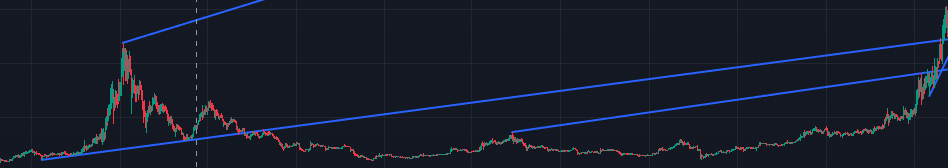
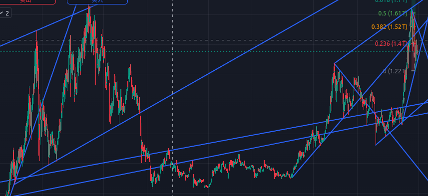

- #交易
- 什么是左侧交易，核心是预测而交易，非跟随趋势。
- 如何进行左侧交易：有两个关键参考因素
	- 时间节点：交易时间不充分不能出极限价格。具体对于抄底时间段的判断，可以用两个方法
		- [[神奇九转]]：对于币圈大周期交易，8小时周期的九转很关键，多周期九转周期共振就更好了。
		- 均线纠缠：介入时机是均线又空头排列转向反复纠缠，快均线第一次上破后下坡，代表此时价格偏离均线较大，可能是较好的买入时机
	- 空间节点：具体进场出场的点位
		- [[斐波那契趋势]]：通过斐波那契趋势预测
		- [[唐安奇通道]]：通过唐安奇通道预测关键支撑位和压力位
		-
		-
- 基于画图的左侧交易：
	- 发现一个很有意思的规律，在total2的日线图上，上个周期牛市底部连线斜率等于这个周期牛市顶部连线斜率。换句话说，根据一个顶部和上个周期的斜率就可以判断下个顶部的大概位置。
	- 
	- 
	-